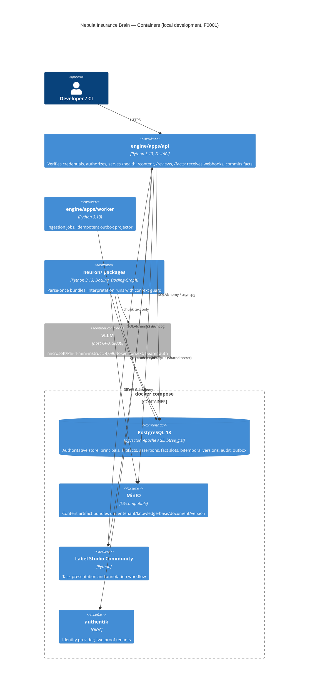

# C4 Level 2 — Containers (F0001 topology)

Created 2026-09-06 (F0001 Phase B, ADR-0054). Updated by any feature that adds a service, changes inter-container communication, or introduces infrastructure.

The API, worker, and `neuron/` packages form one modular monolith (section 114.3); the package list is a code boundary, not a deployment topology. The inference service is a host prerequisite documented in `docker/local-inference-runbook.md`.
