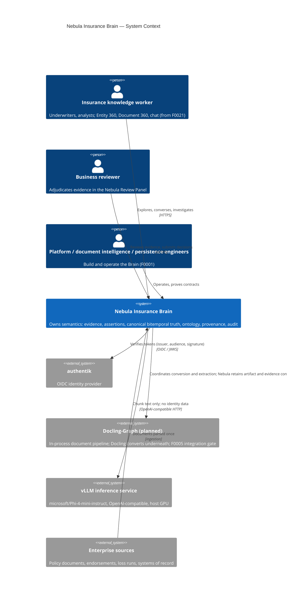

# C4 Level 1 — System Context

Created 2026-09-06 (F0001 Phase B); revised 2026-09-08 for ADR-0057 (native review panel). Updated 2026-09-15 for the planned ADR-0060 document pipeline. Master blueprint sections 100, 125, and 126 are the narrative source.

Boundaries: the Brain owns semantics (ADR-0001); every external system is an engine around it. Human evidence adjudication is not external: the Review Panel is part of the Brain, so evidence never leaves the trust boundary to be reviewed (ADR-0057). Denied paths terminate before protected data enters model context or a canonical mutation occurs (section 118.2).

Docling-Graph is a proposed in-process library, shown here to explain the target dependency boundary. F0001 uses Docling plus a direct vLLM adapter; ADR-0060 does not add an external service. Temporal remains a later durable business-workflow dependency, separate from document-stage coordination.
