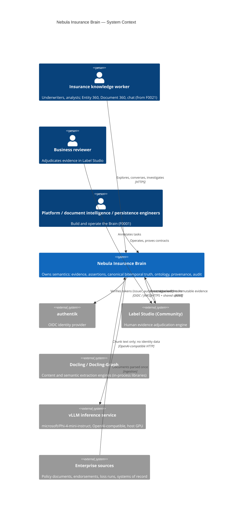

# C4 Level 1 — System Context

Created 2026-09-06 (F0001 Phase B). Master blueprint section 100 is the narrative source.

Boundaries: the Brain owns semantics (ADR-0001); every external system is an engine around it. Denied paths terminate before protected data enters model context or a canonical mutation occurs (section 118.2).
