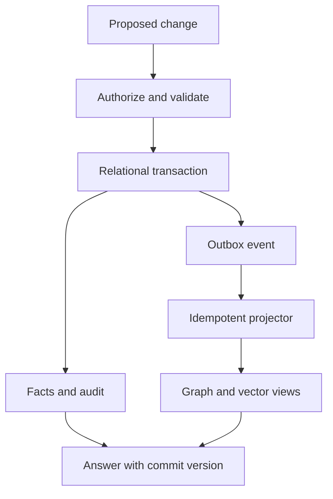
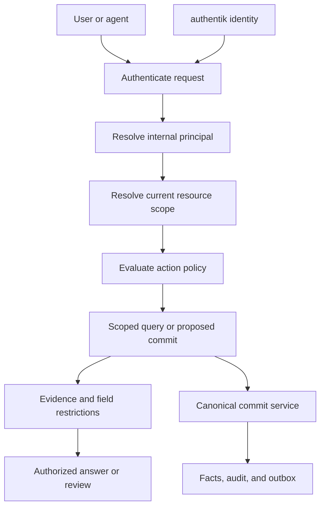

# Nebula Insurance Brain
## Master Architecture Blueprint

**Status:** Initial architecture baseline; proposed decisions are explicitly marked for implementation review.  
**Purpose:** Define the complete architectural intent for Nebula Insurance Brain, including technology direction, semantic contracts, security model, delivery roadmap, and AuthX patterns carried from the reference CRM architecture.  
**Primary goal:** Create enterprise knowledge that is continuously usable, explainable, governable, and enriched over time through documents, systems, conversations, reasoning, and human interaction.

**Planning home:** This document is the architecture baseline inside the `nebula-agents` planning tree. The framework entry point is [`planning-mds/BLUEPRINT.md`](../BLUEPRINT.md); the ADRs in sections 76, 116, and 122 are maintained as individual records under [`decisions/`](decisions/); the repository layout in section 77 was aligned to the framework layer convention on 2026-09-05. See [`planning-mds/README.md`](../README.md) for the section-to-artifact map.

**AuthX reference:** [Architecture patterns](#118-authx-reference-architecture), [implementation gaps](#119-crm-gaps-that-must-not-be-copied-unchanged), [Brain contracts](#120-concrete-authx-contract-for-insurance-brain), and [validation evidence](#121-validation-evidence-and-required-tests).

**Technology direction:**

```text
USE DIRECTLY
    Docling
    Docling-Graph
    Label Studio

REINCORPORATE SELECTED CAPABILITIES / CONCEPTS
    Utopia
    Graphify

STUDY AS REFERENCE / INSPIRATION
    Onyx Chat / conversation UX

NOT ADOPTED INTO THE BRAIN ARCHITECTURE
    RAGFlow
    Omnigraph
```

Mature external capabilities may be used directly when they provide a complete specialist function, while Nebula remains the semantic authority.

---

# 0. Executive Thesis

Nebula Insurance Brain is **not** a document archive, a vector database, a chat-with-PDF system, or a static knowledge graph.

It is a continuously evolving enterprise semantic system.

Its job is to:

- ingest information once at the physical/content level;
- preserve original evidence indefinitely;
- represent what sources claim without prematurely declaring those claims true;
- resolve claims into a governed canonical world model;
- represent business meaning through versioned ontology;
- represent valid-time and knowledge-time history;
- expose knowledge through entities, graph traversal, search, APIs, agents, and conversation;
- learn from every interaction;
- discover concepts, relationships, patterns, rules, document profiles, extraction needs, and reasoning methods;
- enrich previously processed content without repeatedly performing expensive document parsing;
- preserve provenance and reasoning lineage;
- distinguish candidate learning from authoritative enterprise truth;
- support different document types, products, lines of business, jurisdictions, and business contexts;
- let people and agents ask questions of a document, entity, account, policy, claim, process, or the enterprise knowledge base;
- allow conversational discoveries to become governed knowledge when justified.

The defining loop is:

```text
                    ┌──────────────────────────────┐
                    │      ENTERPRISE SOURCES      │
                    │ documents / systems / users  │
                    └──────────────┬───────────────┘
                                   │
                                   ▼
                    ┌──────────────────────────────┐
                    │     CONTENT ACQUISITION      │
                    │ parse once / preserve forever│
                    └──────────────┬───────────────┘
                                   │
                                   ▼
                    ┌──────────────────────────────┐
                    │       ASSERTION PLANE        │
                    │ what sources/models claim    │
                    └──────────────┬───────────────┘
                                   │
                                   ▼
                    ┌──────────────────────────────┐
                    │   CANONICAL WORLD MODEL      │
                    │ governed enterprise knowledge│
                    └──────────────┬───────────────┘
                                   │
                    ┌──────────────┼──────────────┐
                    ▼              ▼              ▼
               Conversation      Agents        Analytics
                    │              │              │
                    └──────────────┼──────────────┘
                                   ▼
                    ┌──────────────────────────────┐
                    │        LEARNING PLANE        │
                    │ concepts / patterns / gaps   │
                    └──────────────┬───────────────┘
                                   │
                           validate / score
                                   │
                    ┌──────────────┼──────────────┐
                    ▼              ▼              ▼
                retain         review         promote
                    │              │              │
                    └──────────────┴──────────────┘
                                   │
                                   ▼
                    ┌──────────────────────────────┐
                    │  ONTOLOGY + WORLD MODEL      │
                    │       become richer          │
                    └──────────────┬───────────────┘
                                   │
                                   └────── repeats
```

> **The Brain owns semantics. Everything else is an engine around it.**

---

# 1. Core Concerns

The Brain has six foundational concerns:

```text
Evidence      What source material exists?
Claims        What does each source, system, model, or person say?
Truth         What does the enterprise currently accept?
Meaning       What do those things mean?
Learning      What new concepts, patterns, relationships, gaps, or methods emerge?
Interaction   How do humans and agents use and enrich the knowledge?
```

Later concerns surround those six:

```text
Execution           Temporal.io
Action Governance   Execution Gate
Retrieval           PostgreSQL FTS + pgvector + AGE graph traversal
Agent Memory         Separate Lethe-style subsystem
Interchange          JSON Schema / JSON-LD / RDF / OWL / OKF / YAML / JSONL
```

---

# 2. What the Brain Is Not

It is not:

```text
PDF → chunks → embeddings → chatbot
```

It is not:

```text
LLM → triples → graph database
```

It is not one universal schema for every line of business.

It is not one giant ontology authored once.

It is not Temporal workflow state masquerading as enterprise truth.

It is not conversation inference silently written into the KG.

It is not pgvector or Apache AGE as an independent source of truth.

---

# 3. Technology Direction

## Backend

```text
Python 3.13+
FastAPI
Pydantic v2
SQLAlchemy 2
asyncpg
Alembic
pytest
uv
Temporal Python SDK
```

## Data platform

```text
PostgreSQL
JSONB
range / multirange types
btree_gist
pgvector
Apache AGE
PostgreSQL full-text search
```

PostgreSQL is authoritative.

Apache AGE provides graph storage/query capability inside PostgreSQL and openCypher traversal. AGE is a projection/query engine, not the owner of enterprise meaning.

pgvector provides exact and approximate vector retrieval. Vectors are retrieval projections, not truth.

## Direct specialist dependencies

```text
Docling
    physical/content extraction
    layout, blocks, tables, coordinates, normalized document representation

Docling-Graph
    semantic/graph-oriented extraction support
    entity and relationship extraction from persisted content

Label Studio
    visual human adjudication
    annotation, correction, entity/relationship review, evidence localization
```

The direct-dependency rule is:

```text
External specialist engine owns its specialist execution.
Nebula owns semantic identity, provenance, review decisions, canonical truth, and audit.
```

Label Studio is therefore treated like Docling and Docling-Graph: **use the product directly rather than recreating its mature specialist capability inside Nebula.**

## Reincorporated architectural capabilities

### Utopia

Utopia remains architectural input for:

```text
world-model thinking
ontology evolution
bitemporal knowledge
provenance
entity resolution
hybrid retrieval
continuous semantic enrichment
```

Nebula does not become a wrapper around Utopia. The concepts are incorporated into the Brain's native semantic model.

### Graphify

Graphify is not introduced as another runtime graph platform.

Nebula reincorporates selected concepts:

```text
explicit vs inferred vs ambiguous interpretation
relationship discovery from already-extracted content
confidence attached to inferred relationships
review routing for uncertain semantic discoveries
```

These concepts become native fields and workflows in the assertion, interpretation, learning, and review planes.

## Reference implementation only

### Onyx

Onyx is **not** a frontend or backend dependency.

Nebula keeps its own native UX and studies Onyx's Chat/conversation implementation for reusable interaction patterns:

```text
message / turn trees
streaming lifecycle
first-class citations
file / attachment interaction
feedback
regenerate / branch behavior
tool activity presentation
conversation history and follow-up mechanics
```

The semantic model, retrieval model, 360 views, evidence model, and conversation scoping remain Nebula-native.

## Explicitly not adopted

```text
RAGFlow
Omnigraph
```

They may remain useful reference projects, but neither contributes a sufficiently unique capability to justify runtime dependency or architectural lineage in the Brain.

## Identity, authorization, and session direction

Carry the CRM's authentik OIDC identity direction and native Casbin policy boundary into Insurance Brain. Keep provider and policy adapters explicit so the Python backend can implement the same contracts without duplicating the CRM's .NET implementation.

- Verify credentials for the receiving service's issuer/audience and security policy before resolving identity or reading any protected storage.
- Map verified `(issuer, subject)` to a stable internal principal shared through a governed registry/integration contract.
- Evaluate typed resource/action policies through a native Casbin adapter, with cross-runtime behavior fixtures.
- Resolve structural tenant/KB membership separately from broker, distribution, account, policy, and evidence scope.
- Enforce actual parent-resource access AND classification; constrain every search/count/graph/model-context path.
- Preserve session error distinctions, bounded coalesced renewal, and no automatic replay of user mutations.
- Prefer a same-origin BFF with server-held tokens as a proposed session transport; settle that ADR explicitly. The CRM's current browser OIDC storage and cookie logout assumptions conflict and must not be copied as one working contract.

The model does not issue authorization decisions or modify active access policy through ordinary knowledge learning. Detailed evidence and required corrections appear in sections 118–123.

## Frontend

Nebula retains its planned native frontend:

```text
React
TypeScript
Vite
React Router
TanStack Query
Zustand
React Hook Form
AJV
JSON Schema Draft 2020-12
shadcn/ui
Tailwind CSS
TanStack Table
Cytoscape.js
react-i18next
```

The frontend is semantic-first, not chat-first. Chat is one interaction modality within Entity 360, Document 360, Account/Policy/Claim/Submission views, search, graph exploration, evidence inspection, and history.

## Semantic interchange

```text
JSON Schema Draft 2020-12
JSON-LD
RDF / N-Triples
OWL / RDFS / SKOS
OKF
YAML
JSONL
```

YAML/JSONL are authoring and interchange formats, not runtime truth stores.

---

# 4. Major Architectural Planes

```text
┌─────────────────────────────────────────────────────────────────┐
│ 1. SOURCE / CONTENT PLANE                                       │
│ Original files, normalized text, tables, blocks, coordinates    │
├─────────────────────────────────────────────────────────────────┤
│ 2. ASSERTION PLANE                                              │
│ What documents, systems, people, models claim                   │
├─────────────────────────────────────────────────────────────────┤
│ 3. CANONICAL WORLD MODEL                                        │
│ Governed entities, facts, relationships, bitemporal truth       │
├─────────────────────────────────────────────────────────────────┤
│ 4. ONTOLOGY / SEMANTIC PLANE                                    │
│ Meaning, concepts, properties, constraints, vocabulary          │
├─────────────────────────────────────────────────────────────────┤
│ 5. LEARNING PLANE                                               │
│ Candidates, hypotheses, patterns, gaps, methods, profiles       │
├─────────────────────────────────────────────────────────────────┤
│ 6. CONVERSATION / INTERACTION PLANE                             │
│ Chat with document/entity/account/claim/policy/enterprise       │
├─────────────────────────────────────────────────────────────────┤
│ 7. PROCESS / EXECUTION PLANE                                    │
│ Semantic process state + Temporal durable workflow execution    │
├─────────────────────────────────────────────────────────────────┤
│ 8. RETRIEVAL / PROJECTION PLANE                                 │
│ FTS, pgvector, AGE graph, optional Qdrant later                 │
└─────────────────────────────────────────────────────────────────┘
```

---

# 5. One-Time Content Extraction

This is a foundational rule.

For a specific document version, expensive physical/content parsing happens once.

```text
Original File
    ↓
Docling
    ↓
Canonical Content Artifact
```

Persist:

```text
original binary/object reference
normalized text / markdown
page boundaries
reading order
headings
paragraphs
lists
tables
cells
images/references
page coordinates
bounding boxes
character offsets
block IDs
section paths
parser name
parser version
parser config hash
source content hash
artifact hash
```

Recommended artifact layout:

```text
/content/
  tenant/
    knowledge-base/
      document-id/
        version-id/
          original.pdf
          normalized.md
          blocks.jsonl
          tables.jsonl
          layout.jsonl
          manifest.json
```

The exact object store is replaceable. The artifact contract is not.

## Semantic interpretation may happen many times

```text
                    ORIGINAL DOCUMENT
                           │
                    expensive once
                           ▼
                 CANONICAL CONTENT ARTIFACT
                           │
       ┌───────────────────┼───────────────────┐
       ▼                   ▼                   ▼
  Ontology v1         Ontology v2         Conversation
       │                   │                   │
       ▼                   ▼                   ▼
 Assertions v1        New Assertions      New hypotheses
                           │
                           ▼
                    richer understanding
```

The Brain becomes smarter by reinterpreting persisted content, not by reparsing the original document.

## Parser migration exception

A parser upgrade does not automatically reparse the corpus.

Reparse only for an explicitly governed reason such as:

```text
critical parsing defect
materially better table extraction
new coordinate model requirement
security remediation
regulatory reconstruction need
```

A migration creates a new ContentArtifactVersion; the old artifact is preserved.

---

# 6. Separate Source, Content, and Interpretation Identity

```text
SourceDocumentVersion
    immutable original input

ContentArtifactVersion
    deterministic parsed representation

SemanticInterpretationRun
    ontology/model/profile-driven interpretation of persisted content
```

Example:

```text
Policy.pdf
    │
    ├── Content Artifact v1
    │       ├── Interpretation A ← GL ontology v1
    │       ├── Interpretation B ← GL ontology v2
    │       └── Interpretation C ← conversation-driven enrichment
    │
    └── Content Artifact v2 ← only if parser migration is approved
            └── Interpretation D
```

---

# 7. Document Profiles

Document type alone is insufficient.

A useful interpretation profile may depend on:

```text
document type
line of business
product
coverage family
jurisdiction
business purpose
business process
language
effective period
source system
```

Example:

```yaml
id: insurance.loss-run.property
document_type: LossRun
line_of_business: Property
purpose: Underwriting
ontology_modules:
  - insurance.loss-run.base
  - insurance.property.claim
  - insurance.property.location
  - insurance.property.peril
```

Versus:

```yaml
id: insurance.loss-run.casualty
document_type: LossRun
line_of_business: Casualty
purpose: Underwriting
ontology_modules:
  - insurance.loss-run.base
  - insurance.casualty.claim
  - insurance.casualty.injury
  - insurance.casualty.litigation
```

---

# 8. Composable Extraction Profiles

Avoid hundreds of giant handwritten schemas.

```text
                    Loss Run Base
                    /    |     \
                   /     |      \
             Identity Financials Status
                   \      |      /
                    \     |     /
                     \    |    /

          ┌────────────────┴────────────────┐
          ▼                                 ▼
   Property Extension                Casualty Extension
   location                          claimant
   cause of loss                     injury
   property damage                   attorney
   CAT event                         litigation
   BI                                medical
   contents                          indemnity
```

Then:

```text
PropertyLossRunProfile
=
LossRunBase
+
PropertyExtension
```

and:

```text
CasualtyLossRunProfile
=
LossRunBase
+
CasualtyExtension
```

This composition pattern also applies to policy, submission, quote, binder, endorsement, inspection, SOV, schedule, claim correspondence, underwriting memo, and financial statement profiles.

---

# 9. Property vs Casualty Loss Run

Shared base:

```text
Claim Number
Policy Number
Loss Date
Report Date
Status
Paid
Reserve
Incurred
Carrier
Insured
```

Property extension:

```text
Location
Building
CauseOfLoss
Peril
Fire
Wind
Hail
Water
Theft
CAT
BuildingDamage
ContentsDamage
BusinessInterruption
PropertyPaid
PropertyReserve
CATEvent
CATCode
```

Casualty extension:

```text
Claimant
InjuryType
BodyPart
AttorneyRepresentation
LitigationStatus
IndemnityPaid
MedicalPaid
ExpensePaid
IndemnityReserve
MedicalReserve
ExpenseReserve
OpenClosed
Severity
```

---

# 10. Progressive Document Classification

Classification can be staged:

```text
Document
    ↓
Loss Run
    ↓
Casualty Loss Run
    ↓
Workers Compensation Loss Run
    ↓
Extraction Profile Selection
```

Classification itself is an assertion until accepted.

---

# 11. Assertion Plane

Assertions record what sources, systems, users, or models claim.

```text
Document A → Assertion A → EachOccurrence = $5M
Document B → Assertion B → EachOccurrence = $10M
```

Both can survive.

An assertion contains:

```text
assertion_id
tenant_id
knowledge_base_id
subject candidate
predicate
value/object
qualifiers
mode
origin
interpretation_basis
source/evidence
valid-time claim
confidence
ontology version
semantic interpretation run
created_at
```

Fact modes remain only:

```text
ASSERTED
OBSERVED
DERIVED
```

They answer:

```text
What semantic kind of knowledge is this?
```

Origin is orthogonal and records where the assertion came from:

```text
DOCUMENT_INTERPRETATION
SYSTEM_OBSERVATION
HUMAN_REVIEW
CONVERSATION_DISCOVERY
RULE_DERIVATION
AGENT_ANALYSIS
```

Interpretation basis is also orthogonal and incorporates the useful Graphify-style distinction:

```text
EXPLICIT
    directly expressed in the evidence

INFERRED
    derived by semantic interpretation from one or more evidence items

AMBIGUOUS
    more than one plausible interpretation remains
```

This answers:

```text
How directly does the evidence support this interpretation?
```

Example:

```text
mode: ASSERTED
origin: DOCUMENT_INTERPRETATION
interpretation_basis: EXPLICIT
confidence: 0.98
```

versus:

```text
mode: ASSERTED
origin: DOCUMENT_INTERPRETATION
interpretation_basis: INFERRED
confidence: 0.74
supporting_evidence: [B14, B19]
```

Relationship discovery follows the same model:

```text
Persisted Content
      │
      ├── explicit relationship extraction ──► assertion_relationship
      │
      └── semantic discovery pass
              │
              ├── INFERRED relationship candidate
              └── AMBIGUOUS relationship candidate
                         │
                         ▼
                  policy / confidence
                         │
                   Label Studio review
                         │
                         ▼
                    ReviewDecision
```

`INFERRED` or `AMBIGUOUS` does not mean false. It means the epistemic basis must remain visible and governance policy decides whether review is required before canonicalization.

Normative and hypothetical semantics remain separate first-class structures.

---

# 12. Canonical World Model

The canonical model represents accepted enterprise knowledge.

Core elements:

```text
Entity
FactSlot
CanonicalFactVersion
CanonicalRelationshipVersion
Evidence
Derivation
Decision
ProcessEvent
```

```text
Assertions
   │
   ├── A1
   ├── A2
   └── A3
        │
        ▼
 Resolution / Validation
        │
        ▼
 Canonical Fact Version
        │
        ▼
 Evidence + lineage back to inputs
```

---

# 13. FactSlot

FactSlot is first-class.

It answers:

> For what semantic question must the Brain maintain one accepted answer at a given valid-time/recorded-time coordinate?

Example:

```text
FactSlot

subject:
Coverage C123

predicate:
hasLimitAmount

qualifiers:
    basis = EachOccurrence
    currency = USD
```

Different slot:

```text
subject:
Coverage C123

predicate:
hasLimitAmount

qualifiers:
    basis = GeneralAggregate
    currency = USD
```

Suggested model:

```text
fact_slot
    slot_id
    tenant_id
    knowledge_base_id
    subject_id
    predicate_id
    qualifier_fingerprint
    cardinality
    ontology_version_created
```

```text
fact_slot_qualifier
    slot_id
    qualifier_property_id
    typed_value
```

The fingerprint is deterministic and canonical; normalized qualifier rows remain authoritative.

---

# 14. Bitemporal Canonical Facts

Every canonical fact has two time dimensions.

```text
VALID TIME
When was it true in the business world?

RECORDED TIME
When did the Brain accept/know it?
```

Example:

```text
Endorsement effective: June 1
Received: June 12

EachOccurrenceLimit = $5M
valid_period = [June 1, infinity)
recorded_period = [June 12, infinity)
```

Queries:

```text
What was true June 5?
    $5M

What did the Brain know June 5?
    previous accepted value
```

---

# 15. Two-Dimensional Temporal Integrity

Conceptually:

```text
EXCLUDE USING gist (
    slot_id          WITH =,
    valid_period     WITH &&,
    recorded_period  WITH &&
)
```

Rows conflict only when all are true:

```text
same fact slot
AND valid-time overlaps
AND recorded-time overlaps
```

This allows old beliefs and later corrections to coexist historically while preventing ambiguous canonical state at a specific valid/recorded coordinate.

---

# 16. Retraction and Correction Semantics

The Brain records why knowledge changed.

```text
CanonicalFactChange
```

Change types:

```text
SUPERSEDED
CORRECTED
RETRACTED
EXPIRED
INVALIDATED
MERGED
SPLIT
```

Example:

```text
Prior fact: $2M
New fact:   $5M
Change:     SUPERSEDED_BY_ENDORSEMENT
```

Versus:

```text
Prior fact: $2M
Change:     RETRACTED_AS_ERRONEOUS_EXTRACTION
```

These are not the same audit event.

---

# 17. Provenance

Every assertion and canonical fact must be explainable.

Evidence may include:

```text
document_id
document_version_id
content_artifact_version_id
block_id
page
section_path
table_id
cell coordinates
character offsets
bounding box
source text
content hash
artifact hash
parser name
parser version
semantic interpretation run
ontology version
extraction profile
contract hash
model provider
model version
prompt version
confidence
interpretation_basis
```

Derived knowledge points to derivation lineage rather than pretending to have direct document evidence.

## Human-review provenance

Human correction is additive and traceable.

Nebula preserves:

```text
review_item_id
external_review_system
external_task_id
external_annotation_id
reviewer_principal_id
review_decision
review_reason
reviewed_at
corrected_from_assertion_id
created_assertion_id
source evidence locator
```

For Label Studio integration:

```text
Docling / Docling-Graph output
        │
        ▼
Assertion + Evidence
        │
        ▼
Nebula ReviewItem
        │
        ▼
Label Studio Task
        │
   reviewer sees
   original page / region
   predicted entity or relationship
   extracted value
   model confidence
        │
        ▼
Label Studio Annotation
        │
        ▼
Nebula Review Adapter
        │
        ▼
ReviewDecision
```

A human correction must **not** mutate the original content artifact or silently overwrite the original machine assertion.

Example:

```text
Assertion A104
EachOccurrence = $20M
origin = DOCUMENT_INTERPRETATION
        │
        ▼
ReviewDecision R88
CORRECT
        │
        ├── A104 remains preserved and rejected/superseded for canonical use
        │
        └── Assertion A105
            EachOccurrence = $2M
            origin = HUMAN_REVIEW
            corrected_from = A104
            evidence = same source region
```

This lets the Brain answer both:

```text
What does the source show?
What did the machine originally infer?
What did the reviewer change?
Who changed it and why?
Which canonical fact resulted?
```

Label Studio owns the review interaction and annotation workflow. Nebula owns the durable semantic review decision and its effect on enterprise knowledge.

---

# 18. Content Identity vs Evidence Identity

```text
content hash
    "is the content identical?"

evidence locator
    "where did this occurrence come from?"
```

Two documents may share identical text but remain distinct evidence.

---

# 19. Ontology Model

Ontology answers:

> What kind of thing is this, and what relationships/properties are meaningful?

Core ontology entities:

```text
Ontology
OntologyVersion
OntologyModule
Concept
Property
RelationshipType
Axiom
Label
Alias
Datatype
Constraint
```

Initial reasoning semantics:

```text
subClassOf
subPropertyOf
domain
range
inverseOf
symmetric
transitive
disjoint
minCardinality
maxCardinality
```

Full OWL-DL remains behind a future provider interface.

---

# 20. Flexible Schema Representation

The ontology needs both normalized runtime structures and flexible authoring/interchange.

Runtime:

```text
normalized PostgreSQL tables
+
JSONB extension metadata
```

Human authoring:

```text
YAML
```

Bulk/generated interchange:

```text
JSONL
```

Formal interchange:

```text
OWL
RDFS
SKOS
JSON-LD
RDF/N-Triples
```

Agent/human knowledge bundles:

```text
OKF
```

No authoring format becomes runtime truth.

Example YAML concept:

```yaml
id: insurance.coverage.limit
kind: concept
version: 1
labels:
  en-US: Limit
parents:
  - insurance.financial.term
properties:
  amount:
    datatype: money
    required: true
qualifiers:
  - insurance.limit.basis
metadata:
  x-nebula-display-name: Coverage Limit
  x-nebula-evidence-required: true
```

---

# 21. Ontology Modules

```text
foundation
insurance-core
party
organization
document
time
money
commercial-lines
    property
    general-liability
    auto
    umbrella
    workers-comp
    financial-lines
claims
    property-claims
    casualty-claims
    workers-comp-claims
broker
reinsurance
underwriting
```

A knowledge base activates the modules it needs.

---

# 22. Foundation Ontology

```text
Thing
Party
Person
Organization
Account
Place
Document
Agreement
Event
Process
Decision
Role
TimeInterval
Amount
Measurement
Identifier
```

---

# 23. Insurance Core

```text
Account
Insured
Broker
Carrier
MGA
Underwriter
Submission
Quote
Binder
Policy
PolicyTerm
Endorsement
Renewal
Coverage
CoverageForm
CoverageTrigger
CoverageTerm
Limit
LimitBasis
Deductible
Retention
Exposure
Risk
Location
Claim
Loss
Premium
Rate
UnderwritingDecision
```

---

# 24. General Liability Semantics

```text
Policy
    └── contains
        Coverage: CommercialGeneralLiability
              │
              ├── hasForm → CG 00 01
              ├── hasTrigger → Occurrence
              ├── hasLimit
              │      ├── amount = $2M
              │      └── basis = EachOccurrence
              └── hasLimit
                     ├── amount = $4M
                     └── basis = GeneralAggregate
```

Initial LimitBasis values:

```text
EachOccurrence
GeneralAggregate
ProductsCompletedOperationsAggregate
PersonalAdvertisingInjury
DamageToPremisesRented
MedicalExpense
PerPerson
PerAccident
PerClaim
Aggregate
```

---

# 25. JSON Schema as Cross-Language Contract

Use JSON Schema Draft 2020-12.

```text
                  Ontology
                     │
             Nebula Schema Compiler
                     │
      ┌──────────────┼──────────────┐
      ▼              ▼              ▼
 JSON Schema     Pydantic       UI Metadata
```

Pydantic is not the ontology.
AJV is not the ontology.
JSON Schema is the shared structural contract.

---

# 26. Validation Layers

```text
JSON Schema
    Is this structurally valid?

Ontology
    Is this semantically meaningful?

Business Rules
    Is this acceptable under policy?
```

Do not collapse the three.

---

# 27. Nebula Schema Annotations

Potential annotations:

```text
x-nebula-concept
x-nebula-display-name
x-nebula-evidence-required
x-nebula-relationship
x-nebula-security-scope
x-nebula-extraction-hint
x-nebula-line-of-business
x-nebula-document-profile
```

AJV handles standard validation.
A Nebula Schema Runtime interprets Nebula metadata.

---

# 28. Semantic Interpretation Runs

Because physical parsing is one-time, semantic evolution is tracked separately.

```text
SemanticInterpretationRun

run_id
document_version_id
content_artifact_version_id
document_profile_id
ontology_version
extraction_profile_version
semantic_contract_hash
model provider
model version
prompt version
scope
reason
status
created_at
```

Reasons:

```text
INITIAL_INTERPRETATION
ONTOLOGY_ENRICHMENT
PROFILE_ENRICHMENT
CONVERSATION_DISCOVERY
MANUAL_REVIEW
BUSINESS_RULE_CHANGE
TARGETED_REINTERPRETATION
```

An interpretation can target a subset of stored blocks.

---

# 29. Incremental Semantic Reinterpretation

Example:

```text
New concept:
AttorneyRepresentation

Affected profile:
CasualtyLossRun

Existing persisted content:
4,000 loss runs
```

Process:

```text
Ontology/Profile Change
       ↓
Dependency Analysis
       ↓
Find relevant persisted blocks
       ↓
Cheap metadata / FTS prefilter
       ↓
Candidate blocks only
       ↓
Targeted semantic interpretation
       ↓
New assertions
       ↓
Canonical reconciliation
```

No Docling rerun.
No full-document reparse.
No mandatory full-corpus semantic extraction.

---

# 30. Knowledge Evolution Engine

Introduce:

```text
brain-evolution
```

Responsibilities:

```text
ontology change impact
profile change impact
new extraction need detection
semantic reinterpretation planning
derived fact invalidation
candidate concept accumulation
candidate relationship accumulation
candidate rule accumulation
candidate skill accumulation
knowledge gap detection
```

Inputs:

```text
new documents
new assertions
canonical changes
conversations
review decisions
new ontology versions
new business rules
new extraction profiles
```

Outputs:

```text
reconsideration candidates
targeted interpretation jobs
ontology candidates
profile candidates
reasoning candidates
review items
```

---

# 31. Learning Plane

The Brain should improve because it is used.

```text
Canonical Knowledge
       │
       ▼
Conversation / Analysis / Agent Work
       │
       ▼
New Understanding
       │
 ┌─────┼────────────────────────────────┐
 ▼     ▼           ▼         ▼         ▼
Fact  Relation   Concept   Pattern    Method
Gap   Candidate  Candidate Candidate  Candidate
       │
       ▼
Learning Plane
       │
 validate / score / accumulate evidence
       │
 ┌─────┼─────────────┐
 ▼     ▼             ▼
retain review      promote
```

The Brain may autonomously enrich candidate knowledge.
It may not silently redefine authoritative enterprise truth.

---

# 32. Knowledge Maturity Lifecycle

```text
EPHEMERAL
    ↓
CANDIDATE
    ↓
SUPPORTED
    ↓
REVIEWED
    ↓
CANONICAL
```

Not every category requires every stage. Deterministic low-risk derivations may be auto-promoted by policy.

---

# 33. What the Brain Can Learn

Candidate:

```text
facts
relationships
aliases
entity matches
concepts
subtypes
ontology properties
rules
reasoning patterns
analytical methods
document profiles
extraction profiles
derived metrics
process patterns
skills
frequently asked questions
knowledge gaps
missing evidence requirements
```

Example:

```text
Repeated question:
"Is attorney representation present?"

        ↓
Learning plane detects recurring need
        ↓
Candidate profile change:
Add AttorneyRepresentation to CasualtyLossRunProfile
```

---

# 34. Learned Abstractions

Some enterprise concepts emerge from use rather than directly from documents.

Examples:

```text
SubmissionComplexity
BrokerSubmissionQuality
LossDeterioration
RecurringLossPattern
CoverageGap
ExposureConcentration
RenewalRisk
```

```text
facts + relationships + repeated analysis
                 ↓
            pattern detection
                 ↓
          candidate abstraction
                 ↓
          ontology governance
```

---

# 35. Learning Provenance

Learned candidates must retain why they exist.

```text
CandidateRelationship

subject:
Broker B12

predicate:
associatedWith

object:
LowSubmissionCompleteness

supporting_facts: 47
supporting_conversations: 8
contradicting_examples: 6
confidence: 0.78
status: SUPPORTED
```

"AI thinks this" is never sufficient provenance.

---

# 36. Conversation Is Knowledge-Producing

Conversation roots:

```text
Document
Entity
Account
Policy
Submission
Claim
Coverage
Process
Scenario
KnowledgeBase
```

Conversation is analytical work, not just UI around RAG.

---

# 37. Semantic Conversation Engine

Introduce:

```text
brain-conversation
```

Capabilities:

```text
Chat with Document
Chat with Entity
Chat with Account
Chat with Policy
Chat with Claim
Chat with Submission
Chat with Process
Chat with Knowledge Base
```

A conversation begins with an explicit semantic root and may expand through permitted semantic relationships.

The implementation is native Nebula. Onyx is studied as a reference implementation for interaction mechanics, not adopted as a runtime dependency.

Useful Onyx-inspired mechanics to implement natively:

```text
ConversationTurn tree
    parent_turn_id
    child branches
    latest branch

streaming lifecycle
    input
    resolving_context
    retrieving
    traversing_graph
    tool_activity
    reasoning
    streaming
    complete

first-class citations
attachments / source documents
message-level feedback
regenerate into a branch
follow-up queueing
conversation history
```

This produces a conversation model closer to analytical investigation than a flat transcript.

```text
"Why did casualty deteriorate?"
              │
              ▼
           Answer
          /      \
         /        \
   "Show claims"  "Show pricing"
         │              │
         ▼              ▼
   claim branch      pricing branch
```

The tree is conversational state only. It does not replace the enterprise graph or canonical knowledge model.

---

# 38. Chat with Document

A document-scoped conversation may draw from:

```text
persisted content
source blocks
tables
assertions
entities mentioned
canonical entities resolved from assertions
related documents
ontology
conversation history
```

Example:

```text
Root: CasualtyLossRun.pdf

Q: Which claims are still open?
Q: Which have attorney representation?
Q: How does that compare with the current policy?

Scope expands:
Document → Claims → Account → Policy
```

---

# 39. Chat with Entity

Example root:

```text
ACME Manufacturing

Account
├── Insureds
├── Policies
│   ├── Property
│   ├── GL
│   ├── Auto
│   └── Umbrella
├── Claims
├── Locations
├── Submissions
├── Documents
├── Broker
└── Decisions
```

Question:

```text
Why did casualty pricing deteriorate over the last three renewals?
```

Answer construction may combine canonical facts, historical policies, loss runs, claims, premium, exposure, derived metrics, temporal comparisons, and source evidence.

---

# 40. Conversation Graph

Three graph classes:

```text
1. Assertion Graph
   what sources claim

2. Canonical Knowledge Graph
   accepted enterprise knowledge

3. Conversation Graph
   temporary analytical reasoning context
```

Conversation Graph may contain:

```text
canonical nodes
assertions
source passages
temporary entities
derived links
hypotheses
aggregations
unmapped concepts
```

---

# 41. Conversational Hypotheses

Question:

```text
"Are these three water losses related?"
```

Existing KG may have no explicit edge.

Conversation may notice:

```text
same location
same cause family
close dates
same plumbing system
```

and create:

```text
ConversationHypothesis:
Claims C1, C2, C3 possibly share RecurringPlumbingFailure
```

This is not canonical by default.

---

# 42. Conversation-to-Knowledge Promotion

```text
ConversationHypothesis
        │
        ▼
Promotion Service
        │
        ├── ontology mapping
        ├── provenance
        ├── confidence
        ├── authorization
        ├── conflict check
        └── review policy
        │
        ▼
Assertion / Candidate / Review Item
        │
        ▼
Canonicalization if approved
```

---

# 43. Conversation Knowledge Artifact

Do not treat raw transcript as the only memory artifact.

Generate structured checkpoints:

```text
ConversationKnowledgeArtifact

root_context
questions_explored
facts_used
relationships_discovered
temporary_derivations
hypotheses
derived_metrics
knowledge_gaps
ontology_candidates
document_profile_candidates
extraction_profile_candidates
reasoning_pattern_candidates
skill_candidates
```

This feeds the learning plane.

---

# 44. Semantic Answer Provenance

```text
Answer
│
├── Canonical Fact F1
│      └── Assertion A4
│             └── Evidence Block B22
│
├── Canonical Fact F8
│      └── Derived from F2 + F3
│
└── Conversation Hypothesis H1
       ├── Fact F1
       ├── Fact F8
       └── Passage P14
```

"Show me why" should traverse stored lineage, not ask the model to invent a retrospective explanation.

Citations are first-class interaction objects, not merely generated `[1]` text.

```text
ConversationCitation
    answer_turn_id
    citation_number
    evidence_reference_id
    assertion_id / canonical_fact_version_id when applicable
    source_document_version_id
    content_artifact_version_id
    page / block / table / cell / bounding_box
```

The native UX should support bidirectional evidence navigation:

```text
Answer citation
    → exact source page/region
    → assertion
    → canonical fact
```

and:

```text
Source region
    → assertions derived from it
    → canonical facts using it
    → conversations/decisions that cited it
```

This is where the Onyx-inspired idea of citations as structured UI state becomes a deeper Nebula provenance capability.

---

# 45. Reasoning Patterns

The Brain may learn how people reason.

Example:

```text
1. Review five-year loss history.
2. Normalize against exposure.
3. Separate CAT from non-CAT.
4. Analyze frequency versus severity.
5. Identify large-loss drivers.
6. Check exposure growth.
7. Compare pricing trend.
```

Repeated use may create:

```text
ReasoningPatternCandidate:
CasualtyLossTrendAnalysis
```

Later it may become a skill, rule set, analytical workflow, or agent capability.

---

# 46. Canonical Knowledge Graph

The graph represents:

```text
entities
relationships
typed semantic relationships
process relationships
derivation relationships
evidence lineage references
```

Canonical truth itself remains governed through domain tables.

---

# 47. Apache AGE Role

Apache AGE is the PostgreSQL-native graph engine.

Recommended architecture:

```text
             CANONICAL DOMAIN TABLES
                     │
                     │ authority
                     ▼
              Semantic Commit
                     │
          ┌──────────┴──────────┐
          ▼                     ▼
 relational state          AGE graph projection
 facts/entities             vertices/edges
 bitemporal                 openCypher traversal
 provenance
```

AGE is a graph projection, not a second semantic authority.

---

# 48. AGE Projection Pattern

Example vertex:

```text
(:Entity {
    id: "...",
    concept: "insurance.policy",
    tenant_id: "...",
    knowledge_base_id: "..."
})
```

Example edge:

```text
(:Policy)-[:CONTAINS_COVERAGE]->(:Coverage)
```

Do not duplicate large mutable fact payloads into AGE unnecessarily.

Use AGE for traversal; use canonical tables for exact bitemporal fact state and provenance.

---

# 49. Why AGE Is a Projection

AGE answers:

```text
How are things connected?
What path exists?
What neighborhood should be explored?
```

Canonical tables answer:

```text
What is the accepted value?
When was it valid?
When did we know it?
Why do we believe it?
```

---

# 50. pgvector Role

Embeddings may be created for:

```text
content blocks
documents
entities
concepts
canonical fact summaries
conversation knowledge artifacts
ontology descriptions
```

Embedding metadata includes:

```text
tenant
knowledge base
source type
source ID
model
model version
embedding version
authorization metadata
```

pgvector is a retrieval projection, not truth.

---

# 51. Search Fusion

```text
Question
   │
   ├── FTS
   ├── pgvector
   ├── AGE neighborhood
   ├── ontology expansion
   ├── entity scope
   ├── temporal scope
   └── authorization
          │
          ▼
       Fusion
          │
          ▼
 Evidence-aware semantic context
```

---

# 52. Qdrant

Optional later.

If introduced:

```text
PostgreSQL authoritative state
        ↓
      Outbox
        ↓
      Qdrant
rebuildable retrieval projection
```

---

# 53. Entity Resolution

v0.1 deterministic:

```text
policy number
account ID
claim number
FEIN
NAIC
broker ID
carrier ID
stable source identifiers
```

Later probabilistic:

```text
normalized names
addresses
aliases
structured features
embeddings
graph context
LLM adjudication
```

Outputs:

```text
MATCH
NO_MATCH
REVIEW
```

Merges are reversible.

---

# 54. Conflict Resolution

Conflict is expected.

```text
Policy:       Limit = $2M
Broker email: Limit = $5M
Endorsement:  Limit = $5M effective June 1
```

Resolution considers:

```text
source authority
document type
document version
effective date
endorsement semantics
correction semantics
recorded time
confidence
fact mode
```

Outcomes:

```text
SUPERSEDE
COEXIST
REJECT
REVIEW
```

---

# 55. Derived Knowledge

Example:

```text
EachOccurrenceLimit = $500K
GuidelineMinimum = $1M

         ↓ Rule

CoverageLimitBelowGuideline = true
```

Derived fact retains rule version, input fact versions, derivation time, validity, and recorded time.

---

# 56. Derived Dependency Graph

```text
Input fact changes
       │
       ▼
Find dependent derivations
       │
       ▼
Determine affected valid-time interval
       │
       ▼
Invalidate old derived version
       │
       ▼
Recompute
       │
       ▼
Publish corrected derived version
```

Schema support exists before reasoning ships.

---

# 57. Normative Constraints

Example:

```text
Bound policies must be issued within 24 hours.
```

Model:

```text
NormativeConstraint
    domain
    condition
    requirement
    authority
    valid period
    version
```

Norms are not observed facts.

---

# 58. Hypothetical Scenarios

```text
Scenario:
"What if we increase the attachment point?"

base snapshot
+
assumption overrides
+
derived consequences
```

Scenario results remain isolated unless explicitly promoted.

---

# 59. Process Semantics

PULSE-inspired model:

```text
ProcessType
ProcessInstance
State
Transition
ProcessEvent
Actor
Precondition
Postcondition
TemporalConstraint
NormativeConstraint
HypotheticalScenario
```

Example:

```text
Submission

Received
   ↓
Triaged
   ↓
Assigned
   ↓
Quoted
   ↓
Bound
   ↓
Issued
```

---

# 60. Three Process States

Never collapse:

```text
Brain semantic state
Temporal execution state
Observed downstream-system state
```

Example:

```text
Brain:    Bound
PAS:      Pending
Temporal: Waiting for issuance confirmation
```

The divergence is knowledge.

---

# 61. Canonical Transition Rule

A semantic process transition is:

```text
bitemporal
evidence-backed
authorized
semantically valid
```

Temporal cannot directly update canonical process state.

It calls:

```text
TransitionCommitService
```

---

# 62. Temporal.io

```text
Workflow
    ↓
Activity
    ↓
Proposed semantic change
    ↓
Canonical Commit Service
    ↓
PostgreSQL Brain
```

Temporal history is operational execution history, not enterprise truth.

---

# 63. Decision Ledger

Store:

```text
decision
actor
timestamp
exact fact versions used
recorded-time snapshot
rule versions
ontology version
model/version
result
explanation
```

This enables historical decision replay using what was known then.

---

# 64. Agent Execution Gate

```text
Agent proposes action
        ↓
Execution Gate
        ├── authorization
        ├── ontology constraints
        ├── business rules
        ├── canonical process state
        ├── temporal state
        ├── evidence requirements
        └── unresolved conflicts
        ↓
ALLOW / DENY / REVIEW
```

---

# 65. Tenancy

```text
Tenant
    └── Workspace
          └── KnowledgeBase
```

Every authoritative semantic row carries:

```text
tenant_id
knowledge_base_id
```

**CRM carryover clarification:** `broker_tenant_id` is an external relationship-scope input, not a substitute for the Brain's structural `tenant_id`. Resolve tenant/KB membership from verified identity and trusted grants. Resolve broker/distribution/account/policy scope separately, and allow request filters only to narrow it. Entity resolution or cross-KB references cannot create access grants. See sections 118 and 120.

---

# 66. Principals and Authorization

```text
UserPrincipal
ServicePrincipal
AgentPrincipal
Membership
Role
Permission
ResourceScope
```

Enforce in:

```text
API
commit services
search
vector retrieval
AGE traversal
evidence access
ontology access
conversation context assembly
MCP
execution gate
```

Security filters must participate during retrieval, not after retrieval.

## CRM-aligned AuthX contract

Use authentik OIDC as the reference identity direction, stable internal principal IDs, native Casbin behind `AuthorizationService`, and server-side resource scope. Credentials must be verified before conversation, evidence, or other Brain-owned storage is accessed; forwarding a token to a later CRM call is insufficient.

Authorization is the conjunction of current tenant/KB membership, permitted action, actual resource/parent scope, classification/source restrictions, and any delegation limits. Role-based allows cannot override those required boundaries. Resource attributes are typed and server-hydrated; unused attributes must not masquerade as enforced policy.

Scope rows and relationships before retrieval, counts, facets, snippets, graph paths, and model context; apply safe field projection and recheck access at evidence/download and commit boundaries. Preserve the CRM's authority-union/request-intersection pattern without letting historical business query dates reinstate revoked permissions.

User, service, and agent principals are distinct. An agent acting for a user carries both identities and a bounded, expiring delegation. Review callbacks map to authenticated reviewer principals; annotation is distinct from canonical business approval.

Record policy version/hash, grant revision, actor/delegate, resource/action, decision/reason codes, and trace ID. Policies are governed code/configuration releases; test catalog, matrix, and actual runtime behavior together. Baseline enforcement and audit are required in v0.1. See sections 119–122 for source gaps, session decisions, and release tests.

---

# 67. Multilingual Semantics

Canonical concept ID:

```text
insurance.policy
```

Labels:

```text
en-US: Policy
es-ES: Póliza
fr-FR: Police d’assurance
ja-JP: 保険契約
```

Translation is label metadata, not duplicate knowledge.

---

# 68. Semantic APIs

Initial conceptual API:

```text
/entities
/assertions
/facts
/relationships
/documents
/content
/ontology
/search
/graph
/evidence
/history
/conversations
/learning
/reviews
```

Later:

```text
/processes
/reason
/decisions
/scenarios
```

---

# 69. MCP

Read-first interface:

```text
brain.search
brain.document.get
brain.document.content
brain.entity.get
brain.entity.relationships
brain.entity.history
brain.fact.get
brain.fact.evidence
brain.graph.path
brain.ontology.inspect
brain.changes
brain.conversation.context
brain.ask
```

Writes go through governed services.

Every MCP request uses the same verified principal, current resource scope, policy adapter, and evidence restrictions as the API. Read-only tools can still expose restricted data and require full authorization. Graph expansion and user-selected roots only narrow/expand within existing grants. Agents have no direct canonical SQL write capability; future mutation tools propose changes through authorized commit/review services and bounded delegation. The CRM's forwarded-user-token pattern is not assumed to be an OAuth token-exchange implementation.

---

# 70. Entity 360

Primary enterprise view:

```text
ACME MANUFACTURING

Identity
Relationships
Policies
Coverages
Claims
Locations
Documents
Current Facts
Historical Facts
Evidence
Decisions
Conflicts
Learned Insights
Conversation
```

Support:

```text
View valid as of: 2026-05-01
View as known on: 2026-05-10
```

---

# 71. Document 360

```text
Document

Original
Normalized Content
Classification
Profile
Assertions
Entities Mentioned
Relationships Discovered
Canonical Knowledge Contributed
Conflicts
Evidence Map
Interpretation History
Review History
Learned Gaps
Conversation
```

Document 360 is the primary evidence-oriented Nebula surface.

When an assertion needs specialist adjudication, Document 360 does not recreate annotation tooling. It launches or deep-links the corresponding Label Studio task and then reflects the resulting Nebula `ReviewDecision` back into the document history.

```text
Document 360
   │
   ├── inspect evidence natively
   │
   └── Review required
           │
           ▼
      Label Studio
           │
           ▼
      ReviewDecision
           │
           ▼
      Document 360 history
```

---

# 72. Chat Surface

Every major object can expose:

```text
Ask about this
```

Examples:

```text
Chat with this document
Chat with this account
Chat with this policy
Chat with this claim
Chat with this location
Chat with this submission
```

The root is explicit and context may expand through permitted relationships.

Chat is **not the shell containing the Brain**. It is one interaction modality inside the native semantic UX.

```text
ENTERPRISE KNOWLEDGE UX

Explore            Understand           Converse
   │                   │                    │
360 views           Evidence              Chat
Graph               Timeline              Ask
Search              Provenance            Investigate
Browse              History               Compare
   │                   │                    │
   └───────────────────┼────────────────────┘
                       ▼
                Insurance Brain
```

This is the decisive UX distinction from using Onyx as the frontend. Onyx remains a source of good conversation mechanics; Nebula keeps the product model and interaction architecture.

---

# 73. Graph Explorer

Cytoscape later for:

```text
entity graph
ontology graph
conversation graph
path exploration
relationship inspection
```

Default depth: one hop.
Expansion is lazy.
Avoid unbounded spiderwebs.

---

# 74. Process Reconciliation View

Future UX:

```text
Canonical
    Bound
    ✓ binder evidence

Observed
    PAS Pending
    ⚠ disagreement

Execution
    waiting for issuance confirmation

Normative
    issue within 24h
    12h remaining
```

---

# 75. Human Review and Review Queues

Human adjudication is a first-class capability.

**AuthX boundary:** Verify the review callback, map the reviewer to a stable internal principal, restrict task evidence to current grants, and check assertion/task versions. Separate permission to annotate from permission to adjudicate source authority or approve canonical truth. Reauthorize at commit time; Label Studio completion does not itself confer approval authority. See sections 111 and 120.4.

## v0.1 minimum review path

Ship the smallest review loop needed to validate extraction and create the Golden Corpus:

```text
LOW_CONFIDENCE_ASSERTION
EXTRACTION_CORRECTION
PROVENANCE_CORRECTION
ENTITY_CORRECTION
RELATIONSHIP_CORRECTION
```

Actions:

```text
ACCEPT
CORRECT
REJECT
```

Execution surface:

```text
Label Studio
```

Nebula creates the review task; Label Studio presents the source and annotations; Nebula receives the result and persists a governed `ReviewDecision`.

```text
Source Document
      │
      ▼
Docling content + coordinates
      │
      ▼
Docling-Graph / semantic interpretation
      │
      ▼
Assertion / Relationship Candidate
      │
   review policy
      │
      ▼
Nebula ReviewItem
      │
      ▼
Label Studio Task
      │
      ├── rendered source page
      ├── bounding box / span
      ├── predicted entity / relationship
      ├── extracted value
      └── confidence / evidence
      │
      ▼
Human Annotation
      │
      ▼
Nebula ReviewDecision
      │
      ├── canonical commit effect
      ├── correction lineage
      ├── Golden Corpus update
      └── learning signal
```

## v0.2 generalized governance queues

```text
LOW_CONFIDENCE_ASSERTION
ENTITY_MATCH
FACT_CONFLICT
ONTOLOGY_CANDIDATE
RELATIONSHIP_CANDIDATE
DOCUMENT_PROFILE_CANDIDATE
EXTRACTION_PROFILE_CANDIDATE
CARDINALITY_VIOLATION
RETRACTION
DERIVATION_INVALIDATION
PROCESS_STATE_CONFLICT
NORMATIVE_VIOLATION
KNOWLEDGE_PROMOTION
```

Not every queue requires Label Studio. Label Studio is strongest where a reviewer benefits from seeing source content, spans, boxes, entities, relationships, tables, or other evidence-oriented annotation.

Ontology governance, process conflicts, policy decisions, and knowledge promotion may use native Nebula workbench surfaces.

The review architecture therefore separates:

```text
ReviewItem
    what requires adjudication

Review Surface
    Label Studio or native Nebula workbench depending on task

ReviewDecision
    durable governed semantic result owned by Nebula
```

---

# 76. Architecture Decision Records

> Each ADR below is also maintained as an individual record under `decisions/` (ADR-0001 to ADR-0037 as the Accepted baseline; ADR-0038 to ADR-0053 from sections 116 and 122 as Proposed). The individual records are the working copies; this section is the baseline text as of 2026-09-05.

## ADR-0001 — The Brain Owns Semantics

**Decision:** Nebula owns canonical semantic meaning. Docling, Docling-Graph, Label Studio, AGE, pgvector, Temporal, Cytoscape, AJV, Pydantic, and future reasoners are engines around it.

**Use case:** Replace an extraction library without replacing enterprise meaning.

```text
              BRAIN SEMANTIC CORE
             /    |    |    |    \
            /     |    |    |     \
       Docling   AGE  vector Temporal UI
```

---

## ADR-0002 — PostgreSQL Is the Authoritative Runtime Store

**Decision:** PostgreSQL owns authoritative semantic data.

**Use cases:** bitemporal constraints, provenance, tenant scoping, transactional commits, audit, decision replay.

```text
                 PostgreSQL
        ┌────────────┼────────────┐
        ▼            ▼            ▼
     Relational     AGE        pgvector
     authority     graph       retrieval
```

---

## ADR-0003 — One-Time Content Extraction

**Decision:** Each document version is physically parsed once. Persist canonical content artifacts. Future learning operates on persisted content.

**Use case:** Add `AttorneyRepresentation` six months later without reparsing 4,000 casualty loss-run PDFs.

```text
PDF
 │
 ▼
Parse Once
 │
 ▼
Canonical Content
 │
 ├── interpretation v1
 ├── interpretation v2
 ├── conversation learning
 └── future enrichment
```

---

## ADR-0004 — Source, Content Artifact, and Interpretation Are Separately Versioned

**Decision:** Treat source version, parsed artifact version, and semantic interpretation run as separate identities.

**Use case:** Parser migration changes table coordinates while source remains unchanged.

```text
Source v1
   │
   ├── Content Artifact v1
   │      ├── Semantic Run A
   │      └── Semantic Run B
   │
   └── Content Artifact v2
          └── Semantic Run C
```

---

## ADR-0005 — Three-Plane Knowledge Model

**Decision:** Separate Document/Content, Assertion, and Canonical World Model.

**Use case:** Two sources disagree on a limit. Both assertions survive while canonical resolution chooses accepted state.

---

## ADR-0006 — FactSlot Defines Canonical Semantic Identity

**Decision:** Use first-class FactSlot.

**Use case:** EachOccurrence and GeneralAggregate limits are distinct semantic slots.

```text
Coverage
   │
   ├── FactSlot: EachOccurrence
   │        └── fact versions
   │
   └── FactSlot: GeneralAggregate
            └── fact versions
```

---

## ADR-0007 — Full Bitemporality

**Decision:** Canonical facts maintain both valid and recorded periods.

**Use case:** Endorsement effective June 1 received June 12.

---

## ADR-0008 — Database-Level Temporal Integrity

**Decision:** Use PostgreSQL range/GiST exclusion constraints to prevent ambiguous canonical overlap.

**Use case:** Two concurrent semantic commits race.

---

## ADR-0009 — Explicit Change Semantics

**Decision:** Record why a fact ended: superseded, corrected, retracted, expired, invalidated, merged, or split.

**Use case:** Differentiate a legitimate endorsement from a bad extraction correction.

---

## ADR-0010 — Provenance Is Mandatory

**Decision:** No authoritative fact without source evidence or derivation lineage.

**Use case:** "Why do we believe this?"

---

## ADR-0011 — Ontology Is Versioned and Modular

**Decision:** Ontology consists of composable modules.

**Use case:** Property and casualty loss runs share a base and diverge by LOB.

---

## ADR-0012 — Flexible Authoring, Normalized Runtime

**Decision:** YAML/JSONL/OKF/OWL are authoring/interchange; compile into normalized PostgreSQL runtime structures.

**Use case:** Domain expert reviews an ontology YAML pull request without editing DB rows.

---

## ADR-0013 — JSON Schema Is the Structural Contract

**Decision:** JSON Schema 2020-12 is cross-language structural validation. AJV validates in React. Python validates the same schema. Pydantic is a typed Python runtime model.

---

## ADR-0014 — Document Profiles Drive Interpretation

**Decision:** Interpretation scope depends on document type plus business/domain context.

**Use case:** Property and casualty loss runs load different ontology modules.

---

## ADR-0015 — Extraction Profiles Are Composable

**Decision:** Compose shared base modules with LOB/product-specific extensions.

**Use case:** `LossRunBase + PropertyExtension` versus `LossRunBase + CasualtyExtension`.

---

## ADR-0016 — Semantic Reinterpretation Is Incremental

**Decision:** New semantic learning targets persisted blocks instead of reparsing or universally rerunning full-document extraction.

**Use case:** Add attorney-representation extraction only to candidate casualty blocks.

---

## ADR-0017 — Knowledge Evolution Is First-Class

**Decision:** Build a Knowledge Evolution Engine.

**Use case:** Ontology v14 introduces `RecurringLossPattern`; determine affected profiles, content, derived facts, and candidates.

---

## ADR-0018 — Conversation Is Knowledge-Producing

**Decision:** Conversation may produce candidate facts, relationships, concepts, patterns, methods, and gaps.

**Use case:** User discovers recurring water-loss behavior while analyzing an account.

---

## ADR-0019 — Conversation Knowledge Is Not Canonical by Default

**Decision:** Use a temporary Conversation Graph and explicit promotion workflow.

**Use case:** A model notices a relationship absent from the KG.

---

## ADR-0020 — Learning Plane Is Separate From Canonical Truth

**Decision:** The Brain may learn autonomously, but promotion to authoritative knowledge is governed.

**Use case:** Repeated conversations suggest `BrokerSubmissionQuality` as a new abstraction.

---

## ADR-0021 — Learned Knowledge Requires Provenance

**Decision:** Candidate knowledge stores supporting and contradicting evidence.

**Use case:** A broker-quality pattern must identify which submissions and analyses support it.

---

## ADR-0022 — Apache AGE Is the Graph Projection

**Decision:** Use AGE for graph traversal/openCypher while canonical domain tables remain authoritative.

**Use case:** Traverse Account → Policy → Coverage → Location → Claim, then retrieve bitemporal detail from canonical tables.

---

## ADR-0023 — pgvector Is a Retrieval Projection

**Decision:** Vectors accelerate retrieval but never define truth.

**Use case:** Semantic search finds likely evidence blocks; canonical facts and provenance determine final context.

---

## ADR-0024 — Search Is Multi-Modal

**Decision:** Combine FTS, vectors, graph, ontology, temporal filtering, metadata, and authorization.

**Use case:** "Show open casualty claims related to locations with deteriorating loss trends."

---

## ADR-0025 — Deterministic ER Ships Before Probabilistic ER

**Decision:** v0.1 uses stable identifiers. Fuzzy/embedding/LLM entity resolution follows.

---

## ADR-0026 — Derived Facts Have Dependency Lineage

**Decision:** Derived facts point to exact input fact versions.

**Use case:** Retroactive endorsement invalidates an earlier risk flag.

---

## ADR-0027 — Normative and Hypothetical Semantics Are Not Fact Modes

**Decision:** Fact modes remain ASSERTED, OBSERVED, DERIVED. Normative constraints and scenarios have separate models.

---

## ADR-0028 — Temporal Owns Execution; Brain Owns Semantic State

**Decision:** Temporal proposes state changes only through canonical commit services.

**Use case:** Workflow waits while Brain says Bound and PAS says Pending.

---

## ADR-0029 — Process DSL Is Future

**Decision:** Reserve a PULSE-like custom DSL that compiles to canonical process semantics and never becomes a second truth store.

---

## ADR-0030 — Tenancy Is Structural

**Decision:** Tenant → Workspace → KnowledgeBase exists from the first schema and is enforced throughout retrieval and graph traversal.

---

## ADR-0031 — Agent Memory Is Separate

**Decision:** Future Lethe-style memory is separate from enterprise knowledge and conversation state.

---

## ADR-0032 — Decision Replay Uses Recorded-Time State

**Decision:** Decision ledger points to exact fact versions, ontology versions, and rule versions.

**Use case:** Reconstruct what an underwriter knew on June 7, not what became known later.

---

## ADR-0033 — Qdrant Is Optional

**Decision:** Stay PostgreSQL-first and add Qdrant only when vector retrieval becomes an independent scaling problem.

---

## ADR-0034 — Label Studio Is the Human Evidence-Adjudication Engine

**Decision:** Use Label Studio directly for evidence-oriented annotation, review, and correction rather than rebuilding that specialist UX in Nebula.

**Boundary:** Label Studio owns task presentation and annotation workflow. Nebula owns `ReviewItem`, `ReviewDecision`, provenance, audit, semantic commits, and canonical truth.

**Use case:** A casualty loss-run entity was extracted from page 7 with 0.61 confidence. The reviewer sees the exact source region and predicted entity in Label Studio, corrects it, and Nebula records the correction without mutating the original content artifact or original machine assertion.

---

## ADR-0035 — Interpretation Basis Is First-Class

**Decision:** Preserve `EXPLICIT`, `INFERRED`, and `AMBIGUOUS` interpretation basis independently from `ASSERTED`, `OBSERVED`, and `DERIVED` fact modes.

**Rationale:** Fact mode answers what kind of knowledge is represented. Interpretation basis answers how directly the evidence supports that interpretation.

**Use case:** A relationship between a claim and a recurring plumbing issue is inferred from several passages rather than explicitly written in one sentence.

---

## ADR-0036 — Nebula Keeps a Native Semantic UX; Onyx Is a Reference Implementation

**Decision:** Keep the planned native React/TypeScript Nebula frontend. Study Onyx's Chat implementation for conversation mechanics, but do not adopt Onyx as the Brain frontend or backend.

**Rationale:** Onyx's mature chat mechanics are useful, but its application contracts are coupled to its own retrieval, document, session, persona, and backend models. Nebula's product is semantic-first rather than chat-first.

**Use case:** Account 360 can expose a Chat panel using Onyx-inspired message branching and citations while remaining integrated with Nebula-native graph, temporal, evidence, and entity views.

---

## ADR-0037 — Human Corrections Append; They Do Not Rewrite Evidence

**Decision:** A correction produces a durable review decision and, when appropriate, a new assertion or canonical version linked to the prior assertion. Original source artifacts and original machine interpretations remain historically inspectable.

**Use case:** A model reads `$20M`; a reviewer corrects it to `$2M`. The Brain can reconstruct both the original interpretation and the human correction.

---

# 77. Repository Structure

The layout follows the `nebula-agents` consumer convention of three runtime roots (`engine/`, `experience/`, `neuron/`) plus product-owned asset trees, adopted on 2026-09-05. The package granularity from the original blueprint is preserved beneath those roots. Role ownership per root is declared in `planning-mds/BLUEPRINT.md` section 2.3.

```text
nebula-insurance-brain/

planning-mds/                     # framework planning tree: BLUEPRINT, features, architecture, kg-source, evidence
    BLUEPRINT.md
    architecture/
        master-blueprint.md       # this document
        decisions/                # ADR-0001 onward, one file per ADR

engine/                           # Python backend: API, worker, semantic kernel (backend-developer)
    apps/
        api/                      # FastAPI service
        worker/                   # background and ingestion workers (Temporal from v0.3)
    packages/
        brain-domain/
        brain-persistence/
        brain-content/
        brain-schema/
        brain-ontology/
        brain-graph/
        brain-temporal/
        brain-process/
        brain-provenance/
        brain-resolution/         # deterministic ER in v0.1; a probabilistic ER extension may land in neuron/
        brain-search/
        brain-decisions/
        brain-governance/
        brain-review/
        brain-review-labelstudio/
        brain-security/
    migrations/                   # Alembic
    tests/

neuron/                           # Python AI and semantic runtime (ai-engineer)
    packages/
        brain-ingestion/          # Docling parse-once adapter
        brain-extraction/         # Docling-Graph and extraction-profile execution
        brain-interpretation/     # semantic interpretation runs
        brain-reasoning/
        brain-conversation/
        brain-learning/
        brain-evolution/
        brain-agent-tools/        # MCP surface
    tests/

experience/                       # React and TypeScript web app (frontend-developer)
    src/
    tests/

ontology/                         # authored ontology modules; compiled into normalized runtime structures
    foundation/
    insurance-core/
    commercial-lines/
        property/
        general-liability/
        auto/
        umbrella/
        workers-comp/
        financial-lines/
    claims/
    broker/
    reinsurance/

profiles/                         # document and extraction profiles
    documents/
    extraction/

schemas/                          # runtime JSON Schema contracts; planning-mds/schemas/ holds design-time shared schemas
    canonical/
    generated/

knowledge-packs/
    okf/

integrations/
    label-studio/
        project-templates/
        task-mappers/
        webhook-contracts/

golden-corpus/                    # version-controlled regression fixtures exported from Label Studio (section 96)

scripts/
    kg/                           # knowledge-graph toolchain (product-owned copy of the framework tooling)

docker/                           # container definitions
```

Mapping from the original layout: `apps/api` and `apps/worker` moved under `engine/apps/`; `apps/web` became `experience/`; the AI-facing packages moved to `neuron/packages/`; `docs/adr`, `docs/architecture`, and `docs/domain` moved under `planning-mds/architecture/decisions/`, `planning-mds/architecture/`, and `planning-mds/domain/`; the single top-level `tests/` tree is split per runtime root, with `golden-documents` promoted to `golden-corpus/`.

---

# 78. Core PostgreSQL Tables

```text
tenant
workspace
knowledge_base
principal
membership
role
permission

source_document
document_version
content_artifact
content_block
content_table
content_table_cell

document_profile
document_classification_assertion

ontology
ontology_version
ontology_module
ontology_concept
ontology_property
ontology_relation
ontology_axiom
ontology_label
ontology_alias

extraction_profile
extraction_profile_module
semantic_interpretation_run

assertion
assertion_value
assertion_relationship
assertion_evidence

entity
entity_type
entity_alias

fact_slot
fact_slot_qualifier
canonical_fact_version
canonical_relationship_version
canonical_fact_evidence
canonical_fact_change

derivation
derivation_input

learning_candidate
learning_evidence
knowledge_gap
reasoning_pattern_candidate

conversation
conversation_turn
conversation_turn_citation
conversation_attachment
conversation_feedback
conversation_context
conversation_knowledge_artifact
conversation_hypothesis
conversation_derivation

entity_merge
entity_merge_history
conflict
review_item
review_external_task
review_decision
review_decision_evidence

process_type
process_instance
process_state_definition
process_transition_definition
process_event
process_constraint
normative_constraint
hypothetical_scenario

decision
decision_input

embedding

audit_event
outbox_event
```

---

# 79. AGE Graph Labels

Potential vertices:

```text
Entity
Document
Concept
Process
Decision
ConversationArtifact
```

Potential edges:

```text
RELATED_TO
CONTAINS
MENTIONS
SUBMITTED_BY
INSURED_BY
BROKERED_BY
HAS_COVERAGE
HAS_LOCATION
ARISES_UNDER
DERIVED_FROM
EVIDENCED_BY
SUPERSEDES
PART_OF
```

Graph labels are ontology-mapped semantic relationships.

---

# 80. Content Storage Format

Recommended artifact set:

```text
manifest.json
normalized.md
blocks.jsonl
tables.jsonl
layout.jsonl
```

Why:

```text
Markdown/text
    easy human + LLM consumption

JSONL
    streaming
    row-wise processing
    easy targeted reinterpretation

manifest JSON
    versions / hashes / parser metadata
```

Original source binary is retained separately.

---

# 81. Example Manifest

```json
{
  "document_id": "doc_123",
  "document_version_id": "docv_456",
  "source_hash": "...",
  "parser": {
    "name": "docling",
    "version": "...",
    "config_hash": "..."
  },
  "artifacts": {
    "normalized_text": "normalized.md",
    "blocks": "blocks.jsonl",
    "tables": "tables.jsonl",
    "layout": "layout.jsonl"
  },
  "artifact_hash": "..."
}
```

---

# 82. Example Ontology Module

```yaml
module:
  id: insurance.general-liability
  version: 1

concepts:
  - id: insurance.coverage.general-liability
    parent: insurance.coverage

  - id: insurance.limit.basis.each-occurrence
    parent: insurance.limit.basis

relations:
  - id: insurance.coverage.has-limit
    domain: insurance.coverage
    range: insurance.limit

constraints:
  - subject: insurance.coverage.general-liability
    property: insurance.coverage.has-limit
    min_cardinality: 1
```

---

# 83. Example Document Profile

```yaml
id: document.loss-run.casualty
classification:
  document_type: LossRun
  line_of_business:
    - GeneralLiability
    - AutoLiability
    - Umbrella
    - WorkersComp
base_modules:
  - insurance.loss-run.base
conditional_modules:
  WorkersComp:
    - insurance.claims.workers-comp
  GeneralLiability:
    - insurance.claims.casualty
```

---

# 84. Example Semantic Enrichment Without Reparse

```text
Persisted block:

Claim 10031
Date of Loss: 03/14/2025
Status: Open
Attorney: Yes
Paid Indemnity: 45,000
Reserve: 110,000

Ontology/Profile v1 extracts:
claim, date, status, paid, reserve

Later Profile v2 adds:
AttorneyRepresentation

Targeted reinterpretation:
only candidate claim blocks

New assertion:
Claim 10031 attorneyRepresented = true

No document reparse.
```

---

# 85. v0.1 Goal

v0.1 proves the semantic kernel, the evidence chain, and the minimal human-correction loop, not the entire Brain.

Two semantic vertical slices plus one shared review/evaluation capability.

The v0.1 human-review objective is intentionally narrow:

```text
Docling/Docling-Graph output
        ↓
Assertion + provenance
        ↓
low-confidence / correction policy
        ↓
Label Studio
        ↓
ReviewDecision
        ↓
corrected assertion / canonical commit
        ↓
Golden Corpus + regression fixture
```

---

# 86. v0.1 Slice 1 — GL Policy End to End

```text
Policy Document
      ↓
Parse Once
      ↓
Persist Content Artifact
      ↓
Classify
      ↓
GL Extraction Profile
      ↓
Assertions
      ↓
Confidence / review policy
      ├──────────────► Label Studio review when needed
      │                        ↓
      │                 ReviewDecision
      └────────────────────────┘
      ↓
Deterministic Entity Resolution
      ↓
Canonical Commit
      ↓
FactSlots + Bitemporal Facts
      ↓
Minimal Entity 360
```

Extract at minimum:

```text
Account
Insured
Policy
PolicyTerm
CGL Coverage
CoverageForm
CoverageTrigger
EachOccurrence Limit
GeneralAggregate Limit
ProductsCompletedOperationsAggregate
Deductible / Retention where present
```

Acceptance question:

```text
What is the each-occurrence limit?
```

Must return:

```text
typed value
correct limit basis
policy context
valid time
recorded time
evidence pointer
clickable source region in Document 360
review/correction path through Label Studio when intentionally seeded with a low-confidence or incorrect extraction
```

---

# 87. v0.1 Slice 2 — Bitemporal Endorsement

```text
Original Policy:
EachOccurrence = $2M

Endorsement:
effective June 1
EachOccurrence = $5M

Endorsement received:
June 12
```

Acceptance:

```text
As of May 15: $2M
As of July 1: $5M
What did the Brain know June 5? $2M
```

---

# 88. v0.1 Foundation Hooks

Implement schema hooks for later evolution:

```text
DocumentProfile
ExtractionProfile
SemanticInterpretationRun
InterpretationBasis
ReviewItem
ReviewDecision
LabelStudioExternalTaskRef
ConversationContext
LearningCandidate
Derivation dependency tables
AGE projection IDs
Embedding abstraction
```

Full features need not ship in v0.1.

The first release also implements `CredentialVerifier`, `PrincipalResolver`, `ResourceScopeResolver`, `AuthorizationService`, `EvidenceAccessService`, and minimum authorization-decision audit. Include tested parent/classification conjunction, current grant revision, stable reviewer identity, and the selected session transport. These are concrete behavior requirements, not empty schema placeholders; full agent delegation administration can follow when background/agent operations are introduced.

---

# 89. v0.1 Explicitly Excluded

```text
Cytoscape Graph Explorer
pgvector semantic search
Temporal
Process Workbench
Ontology Workbench
full probabilistic ER
full conflict engine
advanced/generalized review workbenches beyond the Label Studio evidence-correction path
reasoning engine
decision ledger
execution gate
Qdrant
custom process DSL
agent long-term memory
```

Excluding the full Execution Gate and Decision Ledger does not exclude authenticated and authorized writes, review approval checks, current evidence access, or auditable canonical commits. Those basic controls are part of v0.1, including its constrained chat surface.

---

# 90. v0.2 — Governed Knowledge and Retrieval

Add:

```text
probabilistic entity resolution
reversible merges
generalized conflict handling
ontology discovery
Ontology Workbench
Document Profile Workbench
Extraction Profile Workbench
Knowledge Evolution Engine
pgvector
AGE graph projection
hybrid retrieval
Evidence-aware retrieval / grounded generation
Semantic Conversation Engine implemented natively
Onyx-inspired conversation-turn trees, streaming, citations, branching, files, and feedback
Chat with Document
Chat with Entity
Conversation Graph
Graphify-inspired inferred/ambiguous relationship discovery
Learning Plane
knowledge promotion/governance
generalized review queues with Label Studio used for evidence-oriented adjudication
expanded Entity 360
Cytoscape Graph Explorer
Semantic API expansion
read-only MCP
```

---

# 91. v0.3 — Process and Durable Execution

```text
PULSE-style process semantics
canonical process transitions
Temporal.io
TransitionCommitService
Process Workbench
normative constraints
hypothetical scenarios
process reconciliation UI
```

---

# 92. v0.4 — Reasoning and Decisions

```text
native ontology inference
business rule engine
derived knowledge
dependency invalidation
decision ledger
historical replay
execution gate
reasoning-pattern promotion
```

---

# 93. v0.5 — Scale and Advanced Semantics

Possible:

```text
Qdrant
dense + sparse retrieval
multivectors
reranking
broader ontology packs
advanced temporal queries
large knowledge bases
advanced graph analytics
```

---

# 94. Future Reserved

```text
custom executable process DSL
full OWL-DL provider
Datalog provider
advanced scenario simulation
Lethe-style agent memory
verifiable forgetting
Ontology2SQL
Kafka
OpenSearch
microservices
Kubernetes
dedicated graph database if AGE eventually proves insufficient
```

---

# 95. Epic Roadmap

## v0.1

```text
F0001 Repository and engineering foundation
F0002 Tenancy-aware domain kernel + verified stable principal and scope contracts
F0003 PostgreSQL persistence
F0004 Content artifact model
F0005 One-time Docling ingestion
F0006 Assertion plane + origin + interpretation basis
F0007 FactSlot model
F0008 Bitemporal canonical facts
F0009 Provenance + human-correction lineage
F0010 Change/retraction semantics
F0011 JSON Schema contract system
F0012 Foundation ontology
F0013 Insurance Core GL ontology
F0014 Document Profile model
F0015 Extraction Profile compiler
F0016 Semantic interpretation runs
F0017 Deterministic entity resolution
F0018 Canonical commit service + action authorization and policy-version audit
F0019 Basic endorsement supersession
F0020 Minimal graph/temporal query API
F0021 Native React semantic shell + OIDC/session contract and safe re-auth behavior
F0022 Document 360 + Label Studio evidence review integration + parent/classification and reviewer authority
F0023 Minimal Entity 360
F0024 GL vertical slice
F0025 Endorsement bitemporal slice
F0026 v0.1 hardening + Label Studio Golden Corpus workflow + AuthX negative tests and policy parity
```

## v0.2

```text
F0027 Probabilistic entity resolution
F0028 Conflict and supersession
F0029 Ontology discovery
F0030 Ontology Workbench
F0031 Document/Extraction Profile Workbench
F0032 Knowledge Evolution Engine
F0033 pgvector retrieval
F0034 AGE graph projection
F0035 Hybrid search + consistent authorized rows/counts/facets/graph scope
F0036 Evidence-aware retrieval / grounded generation
F0037 Native Semantic Conversation Engine + Onyx-inspired Chat mechanics
F0038 Chat with Document
F0039 Chat with Entity
F0040 Conversation Graph
F0041 Learning Plane
F0042 Knowledge promotion/governance
F0043 Generalized review queues / governance
F0044 Expanded Entity 360
F0045 Cytoscape Graph Explorer
F0046 Semantic API
F0047 Read-only MCP + verified principal, bounded delegation, and evidence access
```

## v0.3

```text
F0048 Process domain model
F0049 Canonical Transition Service
F0050 Temporal.io
F0051 Process Workbench
F0052 Normative constraints
F0053 Hypothetical scenarios
F0054 Process reconciliation
```

## v0.4+

```text
F0055 Native reasoning
F0056 Derived dependency invalidation
F0057 Decision ledger
F0058 Historical decision replay
F0059 Execution gate
F0060 Reasoning-pattern governance
F0061 Advanced retrieval
F0062 Advanced reasoners
F0063 Future DSL
```

---

# 96. Golden Corpus

Start with 20–30 carefully labeled insurance documents:

```text
GL policy
GL endorsement
property policy
property loss run
casualty loss run
workers comp loss run
ACORD application
statement of values
inspection report
quote
binder
broker email
claim correspondence
financial statement
underwriting memo
```

Use **Label Studio as the primary human labeling and correction environment** for evidence-oriented ground truth.

Hand-label and validate:

```text
document classification
entities
entity spans / bounding boxes
facts
qualifiers
relationships
relationship interpretation basis
source evidence
valid time
document profile
extraction profile
human correction lineage where applicable
```

The Golden Corpus is not owned only by Label Studio.

```text
Label Studio Project
       │
       ▼
Human annotations
       │
       ▼
Nebula Golden Corpus Export
       │
       ├── source document/version identity
       ├── expected content/evidence locators
       ├── expected assertions
       ├── expected relationships
       ├── expected canonical result
       └── reviewer/audit metadata
       │
       ▼
Version-controlled regression fixtures
```

This ensures the same review mechanism supports both:

```text
1. evaluation / ground-truth creation
2. production low-confidence correction
```

A production correction that is approved for benchmark use may become a new Golden Corpus example through an explicit governance step.

---

# 97. Evaluation Metrics

```text
document classification accuracy
entity precision / recall
fact precision / recall
qualifier accuracy
relationship accuracy
interpretation-basis accuracy
provenance accuracy
evidence-region / bounding-box accuracy
temporal accuracy
entity resolution accuracy
canonical conflict accuracy
semantic interpretation delta accuracy
conversation citation accuracy
learning candidate precision
ontology candidate usefulness
review agreement / adjudication consistency
Label Studio → Nebula review round-trip accuracy
human-correction regression retention
```

---

# 98. Regression Testing

```text
ontology cycles
bad domain/range
cardinality violations
invalid aliases
duplicate IDs
JSON Schema compile parity
AJV/Python validation parity
Pydantic/JSON Schema conformance
FactSlot fingerprint stability
bitemporal overlap races
retroactive correction
assertion idempotency
canonical commit idempotency
content artifact immutability
parser migration
document profile selection
profile composition
targeted reinterpretation
no unnecessary parser rerun
derived dependency invalidation
authorization leakage
AGE traversal tenant leakage
vector search tenant leakage
conversation hypothesis non-promotion
conversation branch / parent-child turn integrity
structured citation → evidence navigation
Label Studio task mapping
Label Studio webhook idempotency
review decision idempotency
original assertion preserved after correction
corrected assertion lineage
reviewed evidence locator stability
knowledge promotion policy
```

---

# 99. Key Invariants

```text
1. A source document version is immutable.
2. A content artifact version is immutable.
3. Content parsing is not repeated unless source changed or a parser migration is explicitly requested.
4. Semantic interpretation may evolve without reparsing source content.
5. An LLM cannot directly write canonical facts.
6. Assertions may disagree.
7. Canonical facts preserve provenance.
8. Canonical facts are bitemporal.
9. Single-valued FactSlots cannot overlap in both valid and recorded time.
10. Fact changes explain why prior knowledge ended.
11. Conversation hypotheses are not canonical by default.
12. Learning candidates are not canonical by default.
13. Learned knowledge has provenance.
14. Ontology changes are versioned.
15. Extraction profiles are versioned.
16. Reinterpretation is dependency-targeted.
17. AGE is a graph projection, not semantic authority.
18. pgvector is a retrieval projection, not semantic authority.
19. Temporal is execution authority, not semantic-state authority.
20. Agent memory is separate from enterprise truth.
21. Tenant authorization applies before or during retrieval, never only after.
22. Derived facts reference exact input versions.
23. YAML/JSONL/OKF are authoring/interchange, not canonical runtime truth.
24. All semantic writes pass through governed commit services.
25. Label Studio is a human adjudication engine, not semantic authority.
26. Human corrections append durable decisions/assertions; they do not mutate original source/content artifacts.
27. Interpretation basis (EXPLICIT / INFERRED / AMBIGUOUS) is preserved independently from fact mode.
28. Nebula keeps a native semantic UX; Onyx is not a runtime frontend dependency.
29. Chat is an interaction modality within the Brain, not the container for the Brain.
30. Protected Brain/companion storage is accessed only after credential verification and stable-principal resolution.
31. Requested scope and historical business dates cannot expand current access grants.
32. Document classification permission and actual parent-resource permission are both required.
33. All rows, counts, facets, graph paths, citations, and derived artifacts obey current authorization.
34. Agents and reviewers cannot claim approval authority through payload fields or model output.
35. Authorization policy changes follow their own governed release process and are not automatic learning promotions.
36. Session renewal does not automatically replay user-initiated canonical or business mutations.
```

---

# 100. Final System Architecture

```text
                                      USERS / AGENTS
                                           │
        ┌──────────────────────────────────┼──────────────────────────────────┐
        ▼                                  ▼                                  ▼
 NATIVE NEBULA UX                    Semantic APIs / MCP                 LABEL STUDIO
 360 views / Chat /                 agents / integrations              human reviewers
 search / evidence /                      │                                  │
 graph / history                          │                                  │
        │                                 │                                  │
        └───────────────────────┬─────────┴───────────────┐                  │
                                ▼                         │                  │
                     SEMANTIC SERVICE LAYER               │                  │
                                │                         │                  │
         ┌──────────────────────┼──────────────────────┐  │                  │
         ▼                      ▼                      ▼  │                  │
   Context Builder        Commit Services       Governance / Review ◄────────┘
         │                      │                      │
         ▼                      ▼                      ▼
┌────────────────┐    ┌────────────────────┐   ┌──────────────────┐
│ Retrieval      │    │ Canonical World    │   │ Learning / Review │
│                │    │ Model              │   │                  │
│ FTS            │    │                    │   │ ReviewItems       │
│ pgvector       │    │ Entities           │   │ ReviewDecisions   │
│ AGE            │    │ FactSlots          │   │ Candidates        │
│ Ontology       │    │ Bitemporal Facts   │   │ Promotion         │
└───────┬────────┘    │ Relationships      │   │ Gaps              │
        │             └─────────┬──────────┘   └─────────┬────────┘
        │                       │                        │
        └───────────────────────┼────────────────────────┘
                                ▼
                        POSTGRESQL BRAIN
                                │
       ┌────────────────────────┼───────────────────────────────┐
       ▼                        ▼                               ▼
ASSERTION PLANE          ONTOLOGY / SCHEMA                  PROVENANCE
       ▲                        ▲                               ▲
       │                        │                               │
       └────────────────────────┼───────────────────────────────┘
                                │
                       SEMANTIC INTERPRETATION
                    native model + Docling-Graph
                                ▲
                                │
                    CANONICAL CONTENT ARTIFACTS
                                ▲
                                │
                         DOCLING PARSE ONCE
                                ▲
                                │
                         SOURCE DOCUMENTS
```

Technology roles are intentionally asymmetric:

```text
Docling
    direct extraction engine

Docling-Graph
    direct semantic/graph extraction engine

Label Studio
    direct human evidence-adjudication engine

Graphify
    selected semantic capabilities reincorporated into Nebula

Onyx
    Chat/conversation UX reference only

RAGFlow / Omnigraph
    not adopted
```

The Brain owns semantics. Direct dependencies execute specialized capabilities around that semantic core.

---

# 101. Continuous Enrichment Architecture

```text
New Document
    │
    ▼
Docling Parse Once
    │
    ▼
Persisted Content + Coordinates
    │
    ▼
Docling-Graph / Semantic Interpretation
    │
    ▼
Assertions + Relationship Candidates
    │
    ├──────────────────────┐
    │                      │
    ▼                      ▼
confidence/policy       World Model
    │                      │
    ▼                      ├─────────────────────────────────────┐
Label Studio               │                                     │
when review needed          ▼                                     ▼
    │                  Conversation                           New Knowledge
    ▼                      │                                     │
ReviewDecision             ▼                                     ▼
    │               Patterns / Gaps / Hypotheses          Ontology/Profile Change
    ├── corrected assertion │                                     │
    ├── canonical effect    ▼                                     ▼
    ├── Golden Corpus    Learning Plane                      Impact Analysis
    └── learning signal     │                                     │
                            ├──────────────┐                      ▼
                            ▼              ▼               Persisted Content
                         retain         promote                    │
                                           │                       ▼
                                           ▼               Targeted Reinterpretation
                                     Ontology/World Model          │
                                           ▲                       ▼
                                           └──────────────── New Assertions
```

Human correction is therefore part of the learning loop, not a side-channel.

The Brain should learn from repeated correction patterns without silently converting those patterns into canonical truth. Repeated corrections may create:

```text
ExtractionProfileCandidate
OntologyCandidate
EntityResolutionRuleCandidate
RelationshipPatternCandidate
ReasoningPatternCandidate
```

Each still follows normal governance and provenance rules.

---

# 102. Operating Philosophy

Every new document can:

```text
add evidence
add assertions
resolve entities
change canonical truth
expose unknown concepts
reveal extraction gaps
```

Every conversation can:

```text
surface relationships
derive new metrics
identify patterns
discover missing concepts
suggest ontology changes
suggest document/extraction profiles
identify reasoning methods
expose knowledge gaps
```

Every review can:

```text
correct an assertion without destroying its history
improve entity resolution
improve source authority
improve ontology
improve extraction
improve relationship discovery
improve the Golden Corpus
improve future reasoning
```

Every ontology/profile change can:

```text
improve future understanding
selectively enrich previously parsed documents
invalidate derived knowledge
create new analytical possibilities
```

The Brain is therefore a governed learning system, not a static archive.

---

# 103. Final Mental Model

```text
SOURCE
    Original evidence

CONTENT
    Stable extracted representation

ASSERTION
    What someone/something claims

FACT SLOT
    The semantic question being answered

CANONICAL FACT
    What the enterprise accepts

ONTOLOGY
    What it means

GRAPH
    How things connect

VECTOR
    What appears semantically similar

PROVENANCE
    Why we believe it

REVIEW
    How humans inspect evidence, correct interpretation, and create governed feedback

BITEMPORALITY
    When it was true and when we knew it

CONVERSATION
    How humans/agents explore it

LEARNING
    What the Brain notices through use

EVOLUTION
    How learning enriches existing and future knowledge

PROCESS
    How business state changes

TEMPORAL
    How execution survives failures

DECISION LEDGER
    Why actions were taken

EXECUTION GATE
    Whether an agent may act
```

The core promise is:

> **Enterprise knowledge should become more useful, more connected, more explainable, and more complete every time the enterprise uses it.**

It should not need to repeatedly reprocess the same original source material to become smarter.

It should preserve the evidence once, continuously reinterpret that evidence as meaning evolves, learn from human and agent interaction, and promote only governed knowledge into enterprise truth.

---

# 104. Technology Notes and References

- PostgreSQL 18 temporal/non-overlap and exclusion constraint documentation:
  - https://www.postgresql.org/docs/18/sql-createtable.html
  - https://www.postgresql.org/docs/18/btree-gist.html

- Apache AGE:
  - https://age.apache.org/
  - https://github.com/apache/age

- pgvector:
  - https://github.com/pgvector/pgvector

- Direct specialist dependencies selected for this blueprint:
  - Docling: https://github.com/DS4SD/docling
  - Docling-Graph: use the selected Docling-Graph implementation already incorporated into the blueprint
  - Label Studio: https://github.com/HumanSignal/label-studio

- Reference / reincorporated-capability projects from the user's fork collection:
  - Graphify: https://github.com/gajakannan/graphify
  - Onyx: https://github.com/gajakannan/onyx

- Evaluated but not adopted into the architecture:
  - RAGFlow
  - Omnigraph

---

# 105. Blueprint Status

This blueprint defines an expansive architectural destination while keeping delivery slices disciplined. The first implementation should stabilize the semantic kernel, evidence and provenance model, authorization boundaries, and a narrow end-to-end insurance proof before expanding ontology, learning, conversation, and enterprise integrations.

The architecture preserves continuous learning, conversational enrichment, graph evolution, flexible line-of-business and document profiles, bitemporal reasoning, process semantics, agent governance, and enterprise-wide use. Each proposed decision remains subject to the acceptance criteria and release gates defined in this document.

---

# 106. Pre-Build Requirements

**Decision posture:** The recommendations in this section define requirements and proposed contracts for implementation. They become accepted decisions only when their stated tests, owners, and release gates are satisfied.

**Assessment:** The architectural direction is sound. The separation of evidence, assertions, canonical knowledge, ontology, and learning is particularly valuable. The next step is to specify the contracts that make those boundaries work under incomplete documents, contradictory sources, concurrency, changing permissions, and operational failure. Additional platforms are not the main need.

The requirements below are designed to be validated against representative insurance data, the target deployment environment, and the selected service integrations before production release.

## 106.1 What is already covered and should remain

| Existing decision | Why retain it | Relevant sections |
| --- | --- | --- |
| Parse content once; reinterpret it repeatedly | Protects extraction investment while enabling new learning | 5–6, 28–30 |
| Separate assertions from accepted facts | Preserves disagreement instead of overwriting it | 11–16 |
| Versioned, modular ontology and profiles | Accommodates differences by LOB, document, product, and jurisdiction | 19–29 |
| Bitemporality | Supports retroactive endorsements and reconstruction of prior knowledge | 14–16, 63 |
| Human corrections append with provenance | Makes correction inspectable and reusable | 17, 75, ADR-0037 |
| PostgreSQL authority; graph/vector projections | Gives the system a clear commit boundary | 46–52 |
| Native semantic UX with chat in context | Supports account, document, policy, and claim investigation | 36–44, 70–74 |
| Candidate learning before governed promotion | Allows learning without silently redefining accepted knowledge | 30–35, 41–43 |

## 106.2 Priority and timing

**P0** means decide before the affected schema or interface is implemented. It does not mean building every future capability before starting. **P1** means complete before a production pilot uses the relevant capability. **P2** means retain an extension point and defer implementation until justified.

| Priority | Addition or clarification | Current coverage | Required result |
| --- | --- | --- | --- |
| P0 | Insurance domain boundary and systems of record | Broad semantic authority only | Field-level ownership and source-resolution policy |
| P0 | Lossless artifact and evidence handoff | Strong concept; incomplete concrete bundle | Versioned DoclingDocument, locator, and adapter contracts |
| P0 | Missingness, completeness, money, identifiers | Partial | Typed domain contracts with failure examples |
| P0 | Temporal commit and relationship identity | Exclusion constraint sketch | Executable temporal mutation specification |
| P0 | Tenancy, ACL inheritance, derived-data access | Enforcement points listed | Resource-policy model and isolation proof |
| P0 | Durable ingestion and commit recovery | Outbox table and idempotency tests listed | State machine, idempotency keys, transactional outbox |
| P0 | Label Studio edition and evidence mapping | Direct dependency chosen | Working review proof with selected edition |
| P0 | Ontology release and migration contract | Versions and modules listed | Immutable releases, compatibility and impact rules |
| P0 | Application boundary and deployable topology | Large package list | Modular monolith boundary and dependency matrix |
| P1 | Context/answer contract and analytic query routing | Rich conversation model | Scoped answers, abstention, exact calculations |
| P1 | Retention, revocation, deletion, restore behavior | Indefinite retention; forgetting deferred | Policy-driven lifecycle spanning all copies |
| P1 | Learning evidence independence and change budgets | Candidate lifecycle present | Prevent self-reinforcement and uncontrolled work |
| P1 | Measurable release gates and operations | Metrics without targets | Frozen evaluation set, agreed SLOs, restore drill |
| P2 | Broad LOB packs and external vocabulary mapping | Modules reserved | Add one validated domain pack at a time |

# 107. Insurance Meaning and Source Authority

## 107.1 Define the Insurance Brain's boundary

The rename should signal explicit insurance semantics while preserving use across the insurance enterprise: underwriting, claims, operations, distribution, finance, and reinsurance.

The Brain is the authority for **its governed semantic representation**. It does not automatically become the transactional system of record for policy issuance, claim payments, billing, or broker management.

Add a `SourceAuthorityPolicy` keyed by tenant, domain, predicate, business context, effective interval, and policy version. A source can be authoritative for one field and advisory for another.

Illustrative ownership decisions to validate with the business:

| Information | Source family to evaluate | Brain behavior |
| --- | --- | --- |
| Issuance status and policy transaction identifier | Policy administration system | Preserve observed state and reconcile against documents |
| Contract wording and attached endorsements | Authenticated policy package | Apply approved interpretation and precedence rules |
| Paid amounts and reserves at a valuation date | Claims/financial source | Preserve financial basis and source snapshot |
| Proposed coverage request | Submission, broker correspondence | Treat as requested terms until other evidence establishes status |
| Underwriter judgment or exception | Authorized decision record | Store actor, authority, scope, reason, and evidence |

These are proposed responsibility boundaries, not universal statements of contractual or legal precedence. No global rule such as “the newest document wins” or “endorsement always wins” is sufficient. Applicability, authenticity, jurisdiction, forms, and business authority need explicit resolution rules.

**Acceptance example:** A broker requests a $5M limit while an issued policy records $2M. Preserve both assertions; display requested versus issued terms; do not promote the request merely because its extraction confidence is higher.

## 107.2 Make the insurance contract a structured subject

The existing GL model covers declarations well. Extend its contract before broader coverage analysis:

- Stable policy identity, distinct policy terms, renewal links, and transaction versions.
- Document package membership, forms schedule, form number, edition, jurisdiction, and attached endorsement status.
- Endorsement operations such as add, replace, delete, or amend a specified provision, with affected scope and dates.
- Coverage applicability: insured role, covered risk, location, operation, territory, and applicable conditions.
- Separate exclusions, exceptions, definitions, insuring agreements, conditions, sublimits, and defense-cost treatment.
- Preserve policy effective time and timezone where stated; do not reduce every insurance date to a UTC date without its original meaning.

Reserve explicit types for claims-made triggers, retroactive dates, reporting periods, cancellation/reinstatement, layered limits, attachment points, and shared aggregates. Implement only what the selected slice actually needs.

**Acceptance example:** An endorsement changes a limit for one scheduled location. Other locations keep their prior applicable limits. The answer cites both the original provision and the amending provision.

## 107.3 Clarify financial, exposure, and identifier semantics

`Paid`, `Reserve`, and `Incurred` are insufficient as unqualified numbers. Model valuation date, currency, financial component, gross/net basis, recovery treatment, and source-defined calculation basis. A loss run is a dated observation, not automatically the current claims balance.

Do not hardcode a universal incurred-loss formula until the financial components and source convention are known. Derived values must retain the approved formula version and inputs.

Represent money using exact decimals or a defined integer scale, with currency and rounding policy. Avoid binary floating point for authoritative monetary values. Distinguish original from converted currency and retain exchange-rate provenance for conversions.

Represent exposure units and period explicitly: payroll, revenue, area, vehicle counts, and other bases must not silently mix.

Stable identifiers require namespaces. A policy number should normally be resolved with its issuing carrier/source and relevant term context; a claim number with its carrier/source namespace. FEIN, organization names, and addresses must not imply unconditional uniqueness or permanent identity.

**Acceptance example:** Two carriers use the same policy number. The Brain creates two policies. Two annual loss runs repeat a claim: the Brain keeps one resolved claim and two valuation snapshots, rather than summing both as separate losses.

## 107.4 Model missingness and package completeness

Separate information state from fact value. Suggested states:

| State | Meaning |
| --- | --- |
| `NOT_PROCESSED` | Relevant content has not been interpreted |
| `NOT_FOUND` | A recorded interpretation scope did not locate the information |
| `NOT_STATED` | Review of a sufficiently defined source scope concludes it does not state the information |
| `ILLEGIBLE` | The source region cannot be read reliably |
| `AMBIGUOUS` | More than one interpretation remains plausible |
| `CONFLICTING` | Relevant sources disagree |
| `EXPLICIT_NEGATIVE` | Evidence explicitly states absence or a negative |
| `NOT_APPLICABLE` | A documented applicability rule excludes the field |

Do not use one null for all of these. Keep access-denied state in the authorization layer; a response must not reveal the existence of restricted evidence through a missingness explanation.

Track expected versus received forms/pages/attachments, processing completeness, interpretation scope, and source freshness. “Not found” must carry the exact scope searched and cannot imply global absence.

**Acceptance example:** An exclusion endorsement is listed in the forms schedule but not supplied. The answer reports an incomplete package; it does not conclude that the exclusion is absent.

# 108. Content, Interpretation, and Evidence Contracts

## 108.1 Preserve the native DoclingDocument

**Finding:** Sections 5, 80, and 81 list Markdown and flattened JSONL files but do not explicitly retain the full native DoclingDocument JSON.

**Verified technology behavior:** Docling-Graph documents a DoclingDocument JSON input path that skips conversion; its input guide recommends the lossless JSON for highest-fidelity reuse. Raw text and Markdown take different input paths. [R1]

**Proposal:** Add `docling-document.json` to each content artifact, alongside the existing normalized projections. Preserve its schema version and assets required by the selected pipeline. Make that file the default input to the Docling-Graph adapter when reusing parsed documents.

Suggested additions to the artifact manifest:

```yaml
artifact_contract_version: 1
docling_document:
  path: docling-document.json
  schema_version: <captured from actual export>
  sha256: <computed hash>
extraction_quality:
  status: complete_or_partial
  failed_pages: []
  warnings: []
execution:
  parser_package_version: <pinned version>
  model_artifact_digests: []
  configuration_hash: <computed hash>
  environment_digest: <captured build identity>
```

Placeholder fields above are a proposed contract, not a claim that the current pipeline exports them automatically.

**Acceptance:** Parse a policy once, persist the bundle, restart the worker, then interpret it with two profiles. The second interpretation performs no document conversion/OCR and retains valid source pointers.

## 108.2 Make evidence precision explicit

Docling-Graph's documented provenance includes a full ledger and grounding that may be at span, chunk, or document level, with different behavior across extraction modes. A located entity identifier does not prove that every property or relationship is grounded at that same location. [R2]

Add evidence precision to the adapter contract: exact span, table cell, block, page, document, or unresolved. Map external refs to immutable Nebula artifact/block identities; preserve the external provenance ledger with its interpretation run.

Store page-number convention, coordinate origin, units, page dimensions, rotation/crop transform, offset encoding, and text-normalization version. Character positions in Unicode code points and JavaScript UTF-16 code units are not interchangeable; choose one contract and convert at UI boundaries.

Store separate evidence for amount, currency, limit basis, effective date, and relationship applicability when they occur in different regions. Preserve repeated table headers, merged cells, and continuation-table relationships.

**Acceptance:** A reviewer opens a limit amount on a rotated scanned page, corrects its basis from a separate table header, and returns a decision whose locators resolve to both regions. If only page-level grounding exists, the UI displays that precision without inventing a tight bounding box.

## 108.3 Specify the semantic adapter boundary

Define a provider-neutral `InterpretationResult` containing candidate entities, assertions, relationships, evidence bindings, quality signals, warnings, and the exact run configuration.

Docling-Graph output becomes input to Nebula's assertion pipeline. Its local deduplication, graph identifiers, and validation do not replace Nebula entity resolution or canonical commits. Keep external-to-Nebula identifier mappings versioned.

Distinguish extraction confidence, evidence quality, source authority, entity-match confidence, and canonical resolution status. Model self-reported confidence is a signal to evaluate, not a calibrated probability or authorization to commit.

Failed or partial parsing should create a visible quality result. An empty extraction from a failed page cannot count as an explicit negative.

**Acceptance:** An invalid output, timeout, or partial table leaves an inspectable failed/partial run and review item. No incomplete result silently replaces a previously accepted fact.

## 108.4 Refine “parse once” and reproducibility

The existing parser migration exception is useful. Make the operational invariant: one reusable **accepted** artifact for a source version and parser recipe, with retry attempts and governed replacement artifacts recorded separately.

Failed jobs may retry. A quality repair or newly required image analysis may need targeted work on retained source assets. That is distinguishable from re-running expensive conversion merely because an ontology changed.

Replace the description “deterministic parsed representation” in section 6 with “immutable, versioned parsed representation” when this proposal is accepted. Persisting an artifact guarantees stable reuse of those bytes; invoking OCR/models again does not necessarily reproduce them bit for bit.

Decision reconstruction should use stored inputs, outputs, versions, and audit evidence. It should not promise that re-invoking a hosted model later yields identical text.

# 109. Canonical Commits, Time, and Projections

## 109.1 Define FactSlot identity beyond the first scalar example

Specify typed qualifier normalization, Unicode and identifier normalization, omitted versus null qualifiers, deterministic ordering, canonical decimal encoding, and fingerprint algorithm version. Hashes accelerate identity checks; normalized values remain available for equality verification.

Specify whether entity identity is tenant-wide or knowledge-base-local. Recommended starting point: tenant-scoped entity identity with explicit knowledge-base membership and resource grants; facts remain context-scoped where needed. Cross-knowledge-base sharing must be deliberate. This is a decision to settle before foreign keys and merge semantics become entrenched.

For multivalued properties, model member identity and member-level temporal versions. The single-valued overlap constraint in section 15 must not be applied unchanged to a set of multiple legitimate insureds or locations. Relationships also need explicit identity, qualifiers, source support, and temporal membership semantics.

**Acceptance:** Two additional insureds coexist. Removing one by endorsement closes only that membership for the affected time interval.

## 109.2 Specify the bitemporal mutation algorithm

Retain the two-dimensional exclusion design. PostgreSQL's `WITHOUT OVERLAPS` temporal-key syntax covers overlap in one range; it does not by itself implement the blueprint's two independent range-overlap conditions. [R6]

The commit service must:

1. Authenticate the actor and authorize the proposal against current policy.
2. Resolve the slot and load its expected current revision under an appropriate lock/concurrency strategy.
3. Validate nonempty, non-null ranges and the selected time conventions.
4. Split affected valid-time intervals, closing recorded-time visibility of superseded beliefs and inserting the new recorded-time view.
5. Preserve unaffected intervals and prior fact payloads, along with explicit change reasons and evidence.
6. Commit fact changes, review linkage, audit, and outbox events in one database transaction.
7. Return a semantic commit identifier and the resulting fact-version identifiers.

Decide explicitly whether closing a recorded interval is the only permitted update to a historical version, or whether an append-only event representation derives those intervals. Avoid claiming full row immutability while silently updating period endpoints.

Capture `source_received_at`, `artifact_created_at`, `assertion_created_at`, and `canonical_accepted_at` separately. In section 14's example, receipt on June 12 is not necessarily canonical acceptance on June 12 if human review completes June 14. The recorded-time convention must answer that distinction consistently.

**Acceptance:** A retroactive endorsement is accepted after review, then corrected again. Queries at each valid/recorded coordinate return the appropriate version. Concurrent commits cannot create ambiguous accepted state.

## 109.3 Make commit and projection consistency explicit

The AGE diagram in section 47 does not decide whether projection changes occur transactionally or asynchronously. Choose a policy; do not leave both paths implicit.

Recommended default: authoritative relational changes plus outbox in one transaction; idempotent workers update graph and vector projections. Record projection version, source commit, processed watermark, failure state, and rebuild generation.

Current fact answers resolve through canonical tables. Historical graph traversal must use temporal relationship state; traversing only today's topology and hydrating historical values can omit relationships that existed then.

Define read-your-write behavior, maximum tolerated projection lag, rebuild/cutover procedure, and fallback when projections are stale. Authorization must be evaluated against current grants even if the content projection lags.

**Acceptance:** Kill a worker after canonical commit but before graph update. Replay repairs the projection without duplicate edges, and the accepted value remains readable from canonical storage.



# 110. Security, Retention, and Learning Boundaries

## 110.1 Define an authorization envelope

Section 66 correctly lists enforcement points. Add the contract that carries principal, tenant, workspace/knowledge-base grants, resource restrictions, purpose, and current authorization-policy revision through those points.

Tenant IDs are necessary but insufficient. Bind child rows and foreign keys to tenant ownership, enforce object-store access, protect exports and review tasks, and partition caches by effective authorization context. An agent acts as an explicit principal with bounded delegation, not as a privileged substitute for a user.

Use PostgreSQL row security as defense in depth where appropriate, with actual application/worker roles tested. PostgreSQL documents bypass behavior for superusers, `BYPASSRLS` roles, and normally table owners; enabling RLS alone is not proof of isolation. [R5]

Do not assume relational policies automatically secure every AGE traversal. Validate graph queries using the chosen extension, schema layout, role, and query path. Recheck authorization before emitting content to a model, returning an answer, or opening evidence.

pgvector's approximate indexes can scan candidates before filtering, which affects recall under selective filters. That is distinct from exposing unauthorized results. Benchmark tenant/ACL-filtered retrieval and choose exact search, iterative scans, or partitioning as appropriate. Never feed unfiltered candidates to the model. [R7]

**Acceptance:** A user loses access during an open conversation. Subsequent turns, history rendering, cached answers, evidence links, and review tasks follow current authorization policy. Revoked content cannot re-enter context through a summary or learned artifact. Define treatment of already-downloaded material separately; the service cannot recall arbitrary offline copies.

## 110.2 Propagate access restrictions through derivation

Entity visibility does not imply access to every fact about that entity. Derived insights and summaries retain dependencies and an access policy consistent with the supporting material used to produce them.

Start conservatively: a user must be entitled to the evidence dependencies of the served derived result, unless an explicit, authorized declassification or aggregation policy applies. An independently supported public/releasable answer can be recomputed from its permitted evidence path.

**Acceptance:** A restricted claim note contributes to a broker-risk hypothesis. The hypothesis, its embedding, title, counts, and conversation summary cannot expose the note's information to a wider audience merely because the broker entity is broadly visible.

## 110.3 Replace indefinite retention with a governed lifecycle

Sections 0 and 5 use indefinite-preservation language, while section 94 defers verifiable forgetting. Before a production pilot, reconcile that wording with an explicit lifecycle for original files, parsed content, assertions, chat history, review exports, embeddings, derived candidates, caches, and backups.

Proposed wording: **Preserve immutable evidence for its authorized retention period; apply approved hold, deletion, and access policies across dependent representations.**

This blueprint does not prescribe jurisdiction-specific retention periods. The responsible records, security, and legal owners must supply applicable schedules and holds; implement those as versioned policy inputs.

Differentiate source withdrawal, canonical retraction, access revocation, and authorized deletion. They have different effects. A deletion workflow needs a dependency inventory, tombstones where permitted, backup expiration behavior, and restore-time reapplication of deletion/revocation records so restored copies do not become accessible again.

Advanced formal forgetting can remain future work; a practical delete/revoke/restore contract cannot.

## 110.4 Treat documents and conversations as untrusted inputs

Extracted text, annotations, and retrieved passages are evidence, including when they contain instructions. They do not acquire authority over agents, tools, or canonical commits.

Add document intake controls for malformed files, oversized/compressed inputs, parser resource limits, and permitted external fetches. Keep extraction workers separated from business-write credentials. Store secret references, not secrets, in manifests and run metadata.

An approved provider/model routing policy should define which data classifications may be processed where, allowed logging, budgets, and fallback behavior. A timeout must not silently send restricted content to another provider.

**Acceptance:** A PDF contains a prompt instructing the model to change a limit or reveal another account. It can produce no authorized tool action, cross-account retrieval, or canonical mutation.

## 110.5 Prevent learning from becoming self-confirmation

Sections 31–35 support candidate learning, but repeated mentions are not independent evidence. The same assertion quoted in 20 conversations remains one underlying source of support.

Add support lineage and evidence-family deduplication, contradiction tracking, candidate expiration, scope, intended use, owner, and revocation/invalidation propagation. Mark model-generated text so it cannot launder an unsupported claim back into apparently independent evidence.

Distinguish three kinds of change:

| Change | Promotion boundary |
| --- | --- |
| A fact, relationship, or alias | Evidence and canonical resolution policy |
| Ontology/profile/rule definition | Versioned artifact review and regression evaluation |
| Executable skill or model training | Separate engineering/model release process and permitted training data |

Learning through stored knowledge does not require automatic model-weight training. Learned code or skills must not become executable merely because a candidate was frequently suggested.

User statements also need scope and intent. “Assume the limit is $5M” belongs to a scenario; “the system value is wrong” is a correction proposal; neither silently replaces issued terms. Private chat history is not automatically shared organizational knowledge.

**Acceptance:** Ten regenerated answers repeat a false relationship. Support strength does not increase without additional independent evidence. A later retraction invalidates dependent candidates and identifies previously affected answers.

# 111. Label Studio and Human Governance

## 111.1 Pin the edition and prove the exact workflow

Label Studio remains a suitable specialist annotation boundary. However, its official comparison marks project roles/access control, task assignment, and reviewer workflows differently across Community, Starter Cloud, and Enterprise. Community APIs/webhooks and pre-annotations do not imply that every governed review feature is included. [R3]

Before selecting deployment and estimating effort, build a narrow proof with the intended edition:

1. Create a task from immutable evidence and predicted annotations.
2. Display a scanned page, table header/value, and related evidence.
3. Bind the reviewer to a verified Nebula principal.
4. Receive annotation events securely and persist the original event payload/hash.
5. Translate annotations into an authorized Nebula `ReviewDecision`.
6. Reject duplicates and detect decisions based on stale assertion/ontology versions.
7. Commit corrected assertions through Nebula's existing semantic boundary.

If Community is chosen, document how deployment isolation and Nebula-owned review authorization meet the pilot's access requirements. Merely hiding the Label Studio link does not provide isolation. Do not assume a commercially licensed embedding or review feature is available in the chosen edition.

## 111.2 Separate annotation from business approval

A person confirming that the PDF says $2M is performing evidence adjudication. A person deciding that this document governs a particular policy term is making an authority/applicability decision. Store the distinction and enforce reviewer permissions accordingly.

Use reason codes, escalation, explicit stale-review handling, and second review for selected high-impact disputes. A review decision should reference the assertion revision and policy version it adjudicated.

Do not route only low-confidence extractions to review. Add risk-based sampling of high-confidence results, critical missing fields, package incompleteness, impossible values, and conflicts with trusted sources.

**Acceptance:** Two reviewers correct the same assertion differently. Both submissions remain auditable; the second does not silently overwrite the first accepted result. An annotator cannot use a correction event to bypass business approval authority.

# 112. Ontology and Profile Release Engineering

Versioning is present, but the release contract needs definition before building the compiler.

Add immutable module releases, dependency locks, profile/template/compiler hashes, stable semantic identifiers, deprecation aliases, and permitted tenant-specific extensions. A concept identifier must not silently change meaning between versions.

Classify changes as additive, constraint tightening, rename/alias, semantic change, split, merge, or retirement. Each class defines compatibility, migration mapping, affected FactSlots, required reinterpretation, evaluation, and rollback behavior.

Pin each interpretation run to an ontology/profile release. Existing facts retain their original interpretation context; activating a new release does not imply every old document was reinterpreted.

**Important semantic distinction:** Decide which ontology constructs are inference rules and which are validation constraints. For example, a domain/range statement used for inference is not automatically equivalent to rejecting data as structurally invalid. Specify the supported reasoning subset and reject unsupported constructs explicitly rather than silently approximating them.

Keep JSON Schema as the structural contract, while testing shared AJV/Python behavior. Define a supported schema subset, custom annotation handling, defaults/coercion policy, references, decimal representation, and generated Pydantic conformance. JSON Schema validity alone does not establish insurance applicability or evidence quality.

Add a machine-readable domain-pack manifest for ontology modules, document profiles, extraction templates, validation rules, test examples, owners, and license/usage restrictions. External vocabulary mappings should retain namespace and version and require suitable usage rights. The undefined `OKF` interchange reference should remain optional until a precise specification, owner, and example round trip are selected.

**Acceptance:** A coverage concept splits into two more precise concepts. A dry run identifies affected assertions, slots, profiles, embeddings, and derived results; historical queries retain their original meaning; new extraction uses the new release; rollback stops new processing without erasing history.

# 113. Chat With Data and Grounded Answers

## 113.1 Define an explicit context and answer contract

The conversation model is extensive. Add the service contract used by every chat surface:

```yaml
context:
  principal: <authenticated principal>
  root: <document, account, policy, claim, or knowledge base>
  authorized_scope: <resolved resource grants>
  valid_as_of: <explicit time or declared default>
  known_as_of: <explicit recorded time or declared default>
  knowledge_mode: canonical_or_source_or_scenario
  expansion_policy: <bounded permitted relationships>
  semantic_commit: <snapshot or consistent read basis>
  ontology_release: <version>
answer:
  status: answered_or_partial_or_abstained
  claims: []
  evidence_references: []
  derivations: []
  conflicts: []
  missing_information: []
  source_freshness: []
  candidate_discoveries: []
```

The YAML is illustrative, not a finalized API schema. Authorization metadata must be resolved by the service, not trusted from client input.

Make the distinction visible between what a document says, what the Brain currently accepts, and what a scenario assumes. Context expansion should be bounded and visible. Explanations should expose stored evidence, rules, calculations, and decision reasons, without relying on private model reasoning traces.

**Acceptance:** “What does this policy say?” reports its source assertion even if a later endorsement changed the canonical value. “What applies now?” incorporates the applicable endorsement and shows the relevant time basis.

## 113.2 Use structured queries for counts and financial analysis

Add an authorized analytics/query service behind “chat with data.” Vector or graph retrieval can locate evidence, but a nearest-neighbor result set is not a complete population for counts, totals, or loss ratios.

Use typed, versioned query plans against authorized canonical data, with deterministic calculations. Record query plan, time filters, denominator/exposure basis, financial convention, and input snapshot. Prefer parameterized domain queries over unrestricted model-generated SQL in the initial releases.

**Acceptance:** “How many open claims exceed $100K?” executes a complete scoped query, differentiates paid from incurred, declares valuation date, and explains exclusions due to missing values. It does not count only the top retrieved passages.

## 113.3 Add minimal chat sooner without widening v0.1 excessively

The existing v0.1 acceptance question already requires a trustworthy answer. Consider a constrained “chat with this policy” demonstration after the two kernel slices, using deterministic fact lookup and structured citations. This provides early product feedback while leaving the general conversation tree, broad retrieval, and autonomous learning in v0.2.

Add first-class knowledge-gap objects that can become assigned evidence requests or review work items. Any external message or business action still requires the corresponding authorized action workflow.

# 114. Ingestion, Operations, and Cost

## 114.1 Make ingestion durable before adopting full workflow orchestration

Temporal is deferred to v0.3, but v0.1 still needs durable jobs. A PostgreSQL-backed job/outbox mechanism is a reasonable initial implementation within the existing stack.

Define states such as discovered, acquired, quarantined, parsed, partially parsed, interpreted, awaiting review, committed, failed, and cancelled. Persist job attempts, failure stage, lease/heartbeat, retry policy, idempotency key, content hashes, and correlation IDs.

Connector contracts should include source-system identity, source object/version ID, source timestamps, observed permissions, change cursor, deletion/withdrawal events, and source freshness. Files, emails/attachments, and structured system observations share provenance principles but should not be forced through the same PDF parser.

Scope deduplication to permitted tenant/security boundaries. Matching bytes can reuse physical processing without collapsing distinct document occurrences, provenance, or grants. Avoid cross-tenant content-existence leakage through deduplication behavior.

**Acceptance:** Duplicate source notifications, duplicate review callbacks, and crashes after upload or commit do not create duplicate accepted artifacts/facts. An abandoned job becomes recoverable without manually editing semantic records.

## 114.2 Set measurable operational budgets

Track stage latency, pages/blocks processed, model tokens, extraction and reinterpretation cost, review time, parser-reuse rate, retries, queue age, projection lag, and unresolved knowledge age. Keep sensitive text out of routine telemetry.

Measure cost per accepted fact and per completed business case, including human correction, rather than only model-call cost. Partition metrics by LOB, document profile, provider/model, and source quality.

Evolution jobs need an impact preview, bounded scope, deduplication, priority, budget approval policy, pause/cancel, and checkpointed resumption. Batch low-urgency enrichment. A repeated question must not automatically cause a full-corpus semantic run.

**Acceptance:** Adding a profile field estimates affected documents and cost, processes a canary set first, and stops at a configured budget without making unprocessed documents appear fully enriched.

## 114.3 Define deployment and recovery early

Start with a modular monolith: API, worker, and web application, plus PostgreSQL, object storage, and the selected Label Studio deployment. Treat the package list as code boundaries, not 25 independently deployed services. Keep parser/model workers separately resource-controlled where required.

Specify a tested dependency matrix: exact Python/runtime build, Docling and Docling-Graph commits/releases, model weights, PostgreSQL major/minor, AGE build, pgvector, and Label Studio edition/version. PostgreSQL 18 is not inherently ruled out by AGE: the official download page lists a PG18 release. Select and test an exact combination instead of relying on generic compatibility claims. [R4]

Validate availability on the intended hosting environment, extension upgrade path, backup/restore, and operational ownership before deployment assumptions harden. No new graph or vector platform is justified solely by this blueprint.

Set recovery point/time objectives for a pilot and prove a restore of relational state, original content, artifact manifests, ontology releases, and review evidence. Rebuild graph/vector views and reapply deletion/revocation controls. A backup that omits original evidence or cannot restore stable citations is insufficient.

# 115. Evaluation, Release Gates, and Delivery Sequence

## 115.1 Make the Golden Corpus representative of the first slice

The proposed 20–30 documents are useful for an initial harness. Spread across 15 document categories, they cannot establish reliable performance for every category.

Concentrate initial labeling on GL policy packages and endorsements. Include native and scanned PDFs, repeated schedules, rotated pages, missing forms, conflicting limits, identical policy numbers from different carriers, retroactive changes, and deliberately wrong high-confidence extraction.

Separate development/tuning examples from a frozen holdout. Split by related account/policy package and template family where practical so near-duplicate renewals or endorsements do not leak across sets. Production corrections should first enter a governed candidate benchmark pool; they must not silently alter the holdout or expected answers.

Add a small property/casualty loss-run contrast set to test the proposed schema's extensibility. Do not treat that as certification of complete extraction support for those LOBs.

## 115.2 Proposed acceptance gates

The following are proposed pilot gates, not measured performance claims. Numeric quality and operational targets require baseline measurement and named owners.

| Gate | Evidence required before release |
| --- | --- |
| Extraction reuse | Reinterpretation canary adds a field with zero physical conversion/OCR calls |
| Typed fact correctness | Critical accepted facts include value, unit/currency, qualifier, policy scope, and source support |
| Evidence fidelity | All displayed citations in the release suite resolve to the correct immutable source and declared precision |
| Temporal integrity | All designed retroactive, interval-split, concurrent-commit, and recorded-time cases pass |
| Review integrity | Duplicate and stale review cases preserve lineage and cannot bypass approval policy |
| Authorization | No unauthorized content returned in the isolation, revocation, graph, vector, export, and chat suite |
| Ingestion recovery | All designed retry/crash cases recover without duplicate accepted effects |
| Unknown/conflict handling | Missing package, missing value, explicit negative, and source-conflict cases produce the intended distinct outcomes |
| Learning containment | Repetition adds no independent evidence; unsupported candidates do not auto-promote |
| Projection recovery | Rebuild and lag scenarios preserve accurate canonical reads and authorized retrieval |
| Restore | A timed restore recovers evidence, identity, history, and applicable access/deletion policies |
| Measured quality | Field precision/recall, severe-error rate, abstention, review workload, latency, and cost meet agreed targets on the frozen slice |

Passing a finite security test suite is a release gate, not proof that every possible leak is impossible. Report sample sizes and uncertainty for measured extraction performance; avoid a single aggregate accuracy score that hides financially material mistakes.

## 115.3 Revised sequencing proposal

Preserve the existing F0001–F0063 identifiers. Add acceptance criteria to existing epics and split milestones rather than renumbering the backlog.

| Stage | Scope | Existing roadmap mapping |
| --- | --- | --- |
| Pre-build contract proofs | Docling reuse, Label Studio round trip, temporal mutation, authorization/deployment compatibility | F0001–F0005, F0008, F0009, F0022 |
| v0.1A | Typed domain contracts, durable ingestion, immutable evidence, assertion extraction | F0002–F0017 |
| v0.1B | Authorized canonical commits, source resolution minimum, GL limits, temporal endorsement, human review | F0018–F0025 |
| v0.1C | Recovery, deletion/revocation minimum, audit, frozen evaluation, constrained policy question | F0026 and narrow acceptance coverage from F0036–F0039 |
| v0.2A | Governed hybrid retrieval, chat with document/entity/data, projection operations | F0033–F0040, F0044–F0047 |
| v0.2B | Broader resolution, ontology/profile release workflows, candidate learning and targeted enrichment | F0027–F0032, F0041–F0043 |
| v0.3+ | Full process execution, decision replay product, advanced reasoning and skills | F0048 onward |

Baseline authenticated writes, approval checks, source restrictions, and audit are v0.1 obligations. The later full Execution Gate and Decision Ledger can remain separate capabilities. Deferring them must not defer ordinary application security or the audit chain needed by the first review loop.

## 115.4 Proofs required before the respective contracts are frozen

| Proof | Concrete outcome | Suggested owner role |
| --- | --- | --- |
| Parse/reinterpret/evidence | One GL package, two profiles, unchanged content artifact, correct citation mapping | Document intelligence engineer |
| Review round trip | Wrong amount corrected once; replayed/stale callbacks handled with lineage | Application engineer + business reviewer |
| Bitemporal commit | Retroactive and concurrent changes, interval splitting, distinct received/accepted times | Persistence engineer |
| Access and hosting | Two security scopes, revocation, object/review access, exact extension build and restore | Platform/security engineer |

These are small implementation investigations, not a reason to design every future ontology pack before coding. Record actual results and unresolved limitations in ADRs before treating the respective interfaces as stable.

# 116. Proposed ADRs and Explicit Corrections

The following ADR IDs are reserved suggestions, all with **status: Proposed**. They extend the existing decision log without implying approval.

| Proposed ADR | Decision to settle | Example and reference |
| --- | --- | --- |
| ADR-0038 — Semantic Authority and Source Ownership | Field/context-specific authority; transactional systems retain their business role | Requested versus issued limit; section 107.1 |
| ADR-0039 — Typed Insurance Values and Completeness | Qualified values, scoped identifiers, explicit unknowns and incomplete packages | Missing endorsement is not absent exclusion; section 107 |
| ADR-0040 — Lossless Content and Evidence Contract | Native DoclingDocument plus normalized views; honest evidence precision | Reinterpret without OCR; section 108 |
| ADR-0041 — Atomic Semantic Commit and Projection Delivery | Canonical transaction + audit + outbox; versioned/rebuildable projections | Crash after commit; section 109 |
| ADR-0042 — Resource and Derivation Authorization | Enforce current grants across facts, evidence, reviews, derived results, and caches | Restricted note cannot leak via summary; section 110 |
| ADR-0043 — Retention and Revocation Lifecycle | Immutable content within authorized retention; dependency-aware deletion and restore | Deleted source stays unavailable after restore; section 110.3 |
| ADR-0044 — Review Edition and Approval Contract | Selected Label Studio edition; annotation separate from canonical approval | Stale reviewer correction; section 111 |
| ADR-0045 — Ontology Release Compatibility | Immutable module releases, dependency locks, explicit semantic migration | Concept split preserves history; section 112 |
| ADR-0046 — Grounded Answer and Analytic Query Contract | Scope/time/evidence in every answer; exact queries for totals | Complete open-claim count; section 113 |
| ADR-0047 — Controlled Learning and Reinterpretation | Independent support, candidate scope, budgeted jobs, separate executable releases | Repeated hallucination earns no support; sections 110.5 and 114 |
| ADR-0048 — Pilot Evidence and Operational Readiness | Frozen evaluation slice and recovery/access/review gates | Demonstrated GL end-to-end proof; section 115 |

## 116.1 Original statements that need reconciliation

| Existing section | Issue | Proposed correction |
| --- | --- | --- |
| 0, 5, 94 | Indefinite evidence retention versus future forgetting | Authorized retention, holds, deletion, and restore behavior |
| 6 | “Deterministic” parsing overstates a model-backed pipeline guarantee | Immutable versioned artifact; execution reproducibility metadata |
| 14 | Received time appears to stand in for accepted recorded time | Separate receipt, assertion, and canonical acceptance timestamps |
| 13, 15 | Scalar overlap rule versus multivalued slots | Explicit member identity and relationship temporal rules |
| 47–49 | Projection consistency and historical topology are unspecified | Commit/outbox contract and time-aware relationship traversal |
| 53 | Stable identifiers lack namespace/term qualification | Scoped identifiers and collision handling |
| 65 | Tenant/KB ownership leaves shared entity identity unresolved | Explicit identity scope and authorized KB membership |
| 75 | Human annotation can be read as canonical approval | Separate annotation, adjudication, and business authority |
| 80–81 | Native DoclingDocument is missing from the bundle | Persist native JSON and explicit evidence adapter mappings |
| 89, 92 | Full governance delayed while initial writes already occur | Baseline authorization and audit in v0.1 |
| 90 | v0.2 combines too many large capabilities | Split retrieval/chat delivery from ontology/learning workbenches |
| 96–97 | Broad small corpus and metrics without release targets | Narrow frozen slice, representative challenge set, measured thresholds |
| 104 | Docling-Graph dependency is not precisely identified | Pin the selected implementation, release/commit, and adapter contract |

# 117. Sources and Remaining Decisions

These primary references support the technology findings and implementation constraints. Documentation on moving branches does not replace a pinned dependency or an integration test.

- **R1 — Docling-Graph input formats:** [Official input guide](https://docling-project.github.io/docling-graph/fundamentals/pipeline-configuration/input-formats/). Supports native DoclingDocument reuse without conversion and the high-fidelity JSON handoff recommendation.
- **R2 — Docling-Graph provenance:** [Official grounding guide](https://docling-project.github.io/docling-graph/fundamentals/graph-management/provenance/). Supports full-ledger preservation and explicit treatment of grounding precision/fallbacks.
- **R3 — Label Studio editions:** [Official feature comparison](https://labelstud.io/guide/label_studio_compare). Supports verifying roles, review, task assignment, and embedding capability against the selected edition.
- **R4 — Apache AGE deployment:** [Official download page](https://age.apache.org/download/) and [upstream repository](https://github.com/apache/age). Support PG-version-specific build selection, including listed PG18 support; they do not establish the capabilities of a chosen managed host.
- **R5 — PostgreSQL row security:** [PostgreSQL 18 row security](https://www.postgresql.org/docs/18/ddl-rowsecurity.html). Supports testing owner, privileged-role, and application-role behavior.
- **R6 — PostgreSQL temporal/exclusion constraints:** [PostgreSQL 18 CREATE TABLE](https://www.postgresql.org/docs/18/sql-createtable.html). Supports the distinction between one-range temporal keys and explicit multi-column exclusion conditions.
- **R7 — pgvector filtering:** [Official repository, filtering and multitenancy sections](https://github.com/pgvector/pgvector). Supports selective-filter recall testing and index/partition selection.
- **R8 — Docling document representation:** [Official DoclingDocument guide](https://docling-project.github.io/docling/concepts/docling_document/). Describes the structured document representation and its layout/provenance capabilities.

## 117.1 Decisions the implementation team still needs

1. Named owner and approved policy for source authority and canonical promotion in the first GL slice.
2. Tenant/entity/knowledge-base identity scope and pilot access model.
3. Target host, PostgreSQL/extension build, model/provider data policy, and Label Studio edition.
4. Exact Docling-Graph implementation and release/commit; the selected upstream project is `docling-project/docling-graph`.
5. Licensed/authorized representative policy packages and reviewers for the initial corpus.
6. Critical-field acceptance thresholds, review capacity, latency/cost budget, and recovery objectives.
7. Applicable retention schedules, holds, conversation-sharing policy, and deletion/revocation behavior.

Recommended first build objective: a single GL policy package and retroactive endorsement that can be ingested once, interpreted, corrected visually, committed with the right authority and time semantics, and queried with trustworthy evidence. Use that proof to stabilize the kernel before expanding the ontology and learning surfaces.

---

# 118. AuthX Reference Architecture

**Reference snapshot:** 2026-09-03. **Repository:** `gajakannan/nebula-insurance-crm`. **Reviewed default branch:** `main`, commit `47375571b19e3f917c1d22cbc076df41320100ff` (2026-09-03). All CRM references in this blueprint are pinned to that commit.

Here, **AuthX** means authentication, authorization, identity mapping, session lifecycle, and enforcement. It does not mean adopting a Python package named AuthX.

**Disposition:** Carry the relevant CRM architecture into the Insurance Brain, with the corrections and extensions below. Existing CRM implementation is evidence of a pattern, not automatic proof that the pattern is fully enforced on every route. New ADRs remain proposed implementation decisions; the selected patterns and their required corrections are incorporated in the main blueprint and detailed here.

The source assessment inspected the .NET API, native Casbin adapter, broker/distribution scope services, document gates, search projection queries, React OIDC/session code, Neuron thread/action code, selected tests, and related ADRs. This is a source-level review plus focused offline checks, not a penetration test or a certification of a deployed environment.

## 118.1 Patterns to carry forward

| CRM pattern and evidence | Disposition for Insurance Brain | Required adaptation |
| --- | --- | --- |
| authentik OIDC; accepted ADR-006 supersedes the older Keycloak strategy; non-development JWT middleware in `Program.cs` | **Carry** authentik as the default IdP direction | Brain is a distinct protected resource with an explicit audience; provider-neutral identity contract |
| `(issuer, subject)` maps to stable internal UUID in `HttpCurrentUserService` and a unique DB index | **Carry** stable internal principal identity | One governed identity mapping across CRM, Brain, review adapters, and agent services; no email/raw-sub ownership keys |
| Native Casbin via `IAuthorizationService`; DI binds `CasbinAuthorizationService`, not legacy evaluator | **Carry** policy engine boundary | Port through a Python adapter if Brain remains FastAPI; prove policy semantics with shared fixtures |
| Role/resource/action policies plus assignee/creator attributes | **Carry and extend** | Add tenant, KB, resource, evidence, classification, purpose, delegation, and policy-version dimensions |
| Broker scope fails closed for absent/unresolvable mapping | **Carry** server-derived scope | Keep external broker relationship scope separate from the Brain's structural tenant boundary |
| Distribution authority union followed by requested-filter intersection | **Carry** monotonic scope narrowing | User filters and graph expansion can reduce authority, never grant new authority |
| Search visibility is applied before counts, facets, and pagination | **Carry** every retrieval projection | Extend to graph paths, embeddings, snippets, exports, and analytic totals |
| Document parent gate AND classification gate; separate `declassify` action | **Carry the design; repair parent enforcement** | Resolve actual parent resource access; propagate classification to extracted and learned representations |
| Broker-specific response DTOs and server-side field suppression | **Carry** safe response projection | Filter before model context and generation, not merely at final JSON rendering |
| Explicit 401/403 taxonomy, coalesced renewal, no automatic mutation replay | **Carry** session behavior | Resolve token-storage/logout drift; enforce security session limits server-side |
| Private owner-scoped threads, opaque 404 behavior, typed/versioned message parts | **Carry after verified identity** | Add tenant/KB scope and evidence-access checks when history is reopened |
| Neuron forwards the caller token; engine reauthorizes business actions | **Carry bounded user delegation** | Every Brain-owned operation validates identity too; do not equate forwarding with OAuth token exchange |
| Allowlisted actions, content constraints, authoritative business commit before operation references | **Carry** governed action boundary | Keep Brain/CRM ownership distinct; use idempotency and transactional outbox for continuous enrichment |
| Policy matrix, negative tests, parity script, versioned prompt/agent assets | **Carry and broaden** | Test all roles/actions and Python/.NET adapters; authorization policy changes remain separately governed |

## 118.2 Reference request path



Denied paths terminate before protected data enters model context or a canonical/business mutation occurs. Classification, current grants, and delegation are mandatory constraints even when one role grants an action. Log internal reason codes without disclosing restricted resource existence to the caller.

# 119. CRM Gaps That Must Not Be Copied Unchanged

Severity below describes the carryover risk. Actual deployment exposure was not assessed.

## 119.1 High — unverified identity selects Neuron-owned records

**Observed:** `neuron/app/main.py` uses `require_bearer()` to check/extract an Authorization header, then calls `subject_from_token()`. `neuron/app/auth.py` decodes claims without checking signature, issuer, audience, expiry, or revocation and falls back through subject, username, email, and a token digest. Thread list/get/history/rename/delete paths use that result directly; they do not call the engine before accessing Neuron storage. The local Compose configuration exposes Neuron on port 8200.

**Consequence:** Engine verification on later CRM API calls does not authenticate a direct Neuron thread read. Ownership filtering can work correctly and still protect the wrong identity. Equal `sub` strings from different issuers also collapse to the same owner key.

**Offline validation:** Using the unmodified subject resolver and in-memory repository with synthetic data, a fabricated token containing the existing synthetic owner's subject selected that owner's thread. A genuinely different owner was denied. An alternate issuer with the same subject produced the same owner identity. No live endpoint or real user's records were accessed.

**Brain requirement:** Verify credentials before every Brain/companion-owned read or write. Either validate the appropriate JWT at that service, or consume an authenticated, integrity-protected assertion from a trusted gateway with direct ingress blocked. Resolve the verified `(iss, sub)` to the internal principal; reject unknown/invalid identities rather than deriving an anonymous ownership key. Private networking alone does not authenticate a supplied header.

**Release test:** Forged signature, missing/wrong audience, wrong issuer, expired token, empty bearer value, and duplicate-sub/different-issuer cases must fail before any conversation storage access. Verify both gateway and direct-service paths under the intended topology.

## 119.2 High — document parent attributes are not enforced by the Casbin adapter

**Observed:** `DocumentParentAccessResolver` passes `parentType`, `parentId`, and `userId` to authorization. The active `CasbinAuthorizationService` consumes `subjectId`, `assignee`, and `creator` and constructs an object with only type/assignee/creator. The active matcher evaluates role, resource type, action, and a policy condition. It does not evaluate parent ID or parent ownership. Several document permissions, including BrokerUser read/download, use unconditional role/action conditions. `DocumentService` relies on the combined gate for document detail and binary access.

**Consequence:** In this source path, a label called “parent access” does not establish entitlement to the referenced account, policy, or other parent. Passing additional attributes is ineffective if the policy adapter discards them. Classification permission does not repair missing record scope.

**Brain requirement:** Load the authoritative parent and evaluate its actual tenant, KB membership, relationship scope, and resource access. Then AND that result with document classification and requested operation. Use typed resource attributes with adapter coverage checks. Apply the resulting restrictions to content blocks, facts, citations, embeddings, annotations, and derived artifacts.

**Release test:** Two policies in different broker scopes share the same document classification. A broker authorized for policy A is denied policy B's document listing, detail, download, evidence region, and search/chat derivatives. Test a valid token with the same role and a changed resource ID.

## 119.3 High design inconsistency — token storage and logout do not form one contract

**Observed:** The older token-storage ADR describes an in-memory access token and an HttpOnly refresh cookie. ADR-024 instead specifies browser-direct renewal. The frontend configures `WebStorageStateStore` on `sessionStorage`, and `sessionRenewal.ts` calls `signinSilent()`. The lockfile selects `oidc-client-ts` 3.4.1; its pinned `User.toStorageString()` serializes access/refresh tokens when present and `UserManager.storeUser()` writes that serialization to the configured store. The comment that this is memory-only is therefore incorrect.

The backend `/auth/logout` implementation attempts revocation using a `refresh_token` cookie. The OIDC callback does not establish that cookie. The shown flow therefore does not demonstrate that the refresh token actually used by browser renewal is the token revoked by logout. Browser-state removal is not evidence of successful upstream token/session revocation.

**Brain proposal:** Adopt a same-origin backend-for-frontend session pattern: browser holds an opaque Secure/HttpOnly session cookie; server owns tokens and renewal; state-changing cookie-authenticated requests have CSRF protection and origin validation. Preserve the CRM's PKCE/state protections, error distinctions, coalescing, work-restoration UX, and no-auto-mutation-replay rule. This is a proposed deliberate change from the current SPA token transport, not an existing CRM capability.

If direct SPA tokens are retained instead, approve one explicit storage, rotation, revocation, logout, CSP, and refresh-concurrency contract and revise the contradictory comments/ADRs. Do not mix the two models. Test logout with actual issuance/storage/renewal, including upstream failure, rather than only asserting that a cookie-clear response was sent.

## 119.4 Medium — policy parity has drifted

**Executed check:** `python3 scripts/check-policy-parity.py` against the downloaded pinned files exits 1. It finds six BrokerUser allow decisions in matrix section 2.10 and thirteen BrokerUser rows in `policy.csv`.

Seven policy entries are not represented in the matrix section the script checks:

| Resource | Actions |
| --- | --- |
| account | read |
| document | create, download, read |
| document_template | create, link, read |

This proves a contract/parity mismatch, not that every additional permission is unjustified. Some may be described in later feature sections. Reconcile the normative matrix and the checker rather than deleting permissions blindly.

**Brain requirement:** One versioned permission catalog, machine-readable expected cases, full role/action coverage, and adapters tested against the same cases. A BrokerUser-only parser of one document section is insufficient for tenant/KB, review, learning, service principals, and agent delegation.

## 119.5 Additional adaptations before reuse

- **Development bypass:** The CRM's Development JWT branch disables key, issuer, audience, and lifetime checks. The local Compose file selects Development. Keep synthetic identity limited to isolated development/testing; require a production startup/deployment guard and negative tests against the real validator. A frontend build guard cannot secure a backend accidentally deployed in Development.
- **Freshness and account status:** The shown principal mapper provisions by `(iss, sub)` but does not itself reject an inactive profile. Define disabled-user, role-change, grant-revocation, and bounded revocation-latency enforcement. A JWT failure labeled “revoked” is not proof that active revocation detection exists.
- **Policy lifecycle:** The native Casbin adapter loads embedded policy once at construction. That is a deployment-time policy model, not dynamic policy distribution. Add policy version/hash to decisions; specify refresh/invalidation if runtime policy updates are introduced.
- **Role combination:** The current role helper allows when any role allows. For Brain, tenant isolation, classification, explicit restrictions, and delegation ceilings must not be bypassed by adding another permissive role. Test mixed internal/external roles explicitly.
- **Time semantics:** Distribution scope currently accepts an `asOf` date. The Brain must distinguish historical business relationships from authorization now: a historical query must not restore a revoked user's permission. Historical authorization reconstruction is a separate privileged audit operation.
- **Session restoration:** The CRM keys drafts by a user identifier and bounds them by size/TTL. Brain restores should use stable principal + tenant/KB context and a field allowlist. Browser storage and a user-scoped key do not encrypt sensitive drafts or shield them from scripts running in that origin.
- **Service identity:** Forwarded user credentials work for interactive delegated calls only within their audience and scope. Background reinterpretation needs a separate service/agent principal, bounded job grant, expiration, and revocation; never retain a user's refresh token in a job payload.

# 120. Concrete AuthX Contract for Insurance Brain

## 120.1 Principal and policy services

Introduce interfaces inside `brain-security`, not additional mandatory microservices:

| Interface | Responsibility |
| --- | --- |
| `CredentialVerifier` | Validate token/session authenticity, intended audience, times, and required security policy |
| `PrincipalResolver` | Map verified external identity to stable internal user/service/agent principal |
| `ResourceScopeResolver` | Resolve current tenant/KB/resource entitlements from trusted state |
| `AuthorizationService` | Evaluate typed subject/resource/action/context through the chosen native policy adapter |
| `EvidenceAccessService` | Enforce document parent, classification, source ACL, and derived dependency access |
| `SessionService` | Own session, refresh, logout/revocation, and server-side security bounds |
| `DelegationService` | Bind an agent/service to granted user or job authority with scope and expiry |
| `AuthorizationDecisionRecorder` | Record policy version, decision, actor, scope, reason codes, and trace |

The CRM and Brain can share an IdP and identity/permission contracts without sharing privileged database credentials or reusing an API token outside its intended audience. Integrate the existing identity registry or maintain a governed mapping/projection; avoid independently generating unrelated IDs for the same human in each subsystem.

Suggested typed request context:

```yaml
principal:
  principal_id: <stable internal UUID>
  principal_kind: user_or_service_or_agent
  issuer: <verified external issuer when applicable>
  subject: <verified external subject when applicable>
  tenant_id: <resolved tenant membership>
  roles: []
  session_or_delegation_id: <verified reference>
request:
  action: <registered action>
  resource_type: <registered resource type>
  resource_id: <resolved resource>
  knowledge_base_id: <resolved membership context>
  parent_resource: <authoritative parent reference>
  classification: <trusted classification>
  requested_scope: <filters that only narrow authority>
  authorization_time: <current enforcement time>
  business_valid_as_of: <query time>
  business_known_as_of: <recorded-time query>
policy:
  version: <immutable policy release>
  grant_revision: <current entitlement revision>
```

Values representing identity, entitlement, classification, or policy version are server-derived. Client/model claims with the same field names cannot populate trusted context directly. Tenant membership must not be inferred solely from email domains or a model-resolved organization.

## 120.2 Permission catalog and review boundaries

Use resource/action permissions instead of one broad “Brain write” permission. Initial examples:

| Resource | Example actions | Required distinction |
| --- | --- | --- |
| document/evidence | read, download, ingest, classify, declassify | Reading the parent does not automatically authorize every classified artifact |
| assertion | read, propose, correct, reject | Proposing/correcting evidence is separate from committing canonical truth |
| canonical fact | read, accept, supersede, retract | Restricted to authorized commit services operating for an approved actor/policy |
| review | annotate, adjudicate, approve | Label Studio annotation is not unrestricted business approval |
| ontology/profile | propose, validate, publish, retire | Candidate learning cannot publish its own semantic definitions |
| conversation | create, read, update, delete, share | Ownership plus current underlying evidence access; sharing is explicit |
| learning/evolution | propose, promote, schedule, cancel | Independent evidence and budget/delegation policy still apply |
| export/analytics | query, export | Authorized population, fields, purpose, and output restrictions |

These are a proposed catalog, not an already-approved assignment of permissions to business roles. Start with the pilot's roles and concrete expected cases. Preserve the CRM's narrowly named special-purpose action pattern instead of broadening a role whenever one new workflow needs an exception.

## 120.3 Retrieval and graph enforcement

Compute permitted rows/edges before forming model context. Counts, facets, snippets, titles, result existence, cached responses, graph expansion, and evidence links must use the same scope. Use bounded graph traversal; an accessible node does not authorize every adjacent edge or document.

A user's requested account/territory/LOB/date is an analytical filter, not an entitlement grant. Recheck current grants before streaming protected content and on resumed/reopened conversations. A previously valid answer may need redaction, regeneration from permitted evidence, or refusal after revocation.

For derived artifacts, enforce access to the supporting evidence path used to construct the result, or a separately approved declassification/aggregation policy. Knowledge-base sharing is explicit and does not arise from entity resolution merging two records.

## 120.4 Agent, MCP, and Label Studio boundaries

The model may request actions; the typed action registry constrains what can be requested; deterministic services authorize and validate them. Topic/scope guards and JSON Schema validation improve routing and structure but are not substitutes for authentication or authorization.

Preserve `acting_user_id`, `agent_principal_id`, delegation ID, allowed actions/resources, expiry, and policy version. Effective delegated authority is bounded by both the actor's current grant and the delegation ceiling. Record the authenticated actor independently of model-supplied provenance text.

Read-only MCP tools remain protected resource operations. Future writes call the same commit/review services as the web API. Tool adapters may not use unrestricted SQL or direct canonical table writes to bypass those services.

Label Studio tasks contain only the evidence needed for an authorized reviewer. Verify callback origin, resolve the reviewer to a stable principal, check task/assertion revisions, and reauthorize the decision. Task IDs, emails in callback payloads, and annotation completion alone are not proof of approval authority.

## 120.5 Session and UI behavior

Retain distinct outcomes: unauthenticated/invalid credentials trigger sign-in; expired recoverable credentials may renew once through a bounded coalesced path; authorization denial preserves session and displays an in-context message. Suppress resource-existence leakage where policy requires it.

Retain no automatic replay of approve, promote, retract, publish, or external business actions after renewal. An independently designed idempotent command protocol can support controlled retry later, with the same command identity and authority checked again.

UI route guards and hidden controls are convenience only. The backend must reject direct requests. Clear or scope query caches and in-flight work on logout, principal change, tenant switch, or relevant grant revision. Enforce session timeouts and revocation in the session/token control plane; an idle-warning modal is UX, not the security boundary.

# 121. Validation Evidence and Required Tests

## 121.1 Checks executed during source and implementation validation

| Check | Result | What it establishes |
| --- | --- | --- |
| Repository metadata and pinned commit | Recorded full commit and complete file-tree listing | Evidence is tied to a specific source snapshot |
| Existing `neuron/tests/test_auth.py` | 3 tests passed | Existing decoder behavior works as written; these tests do not establish credential verification |
| Synthetic identity/repository reproduction | Unverified selected subject accessed synthetic owner's thread; other owner was denied | Credential trust is missing before otherwise-working ownership filtering |
| Same subject, different issuer reproduction | Same owner string returned | Raw-sub ownership lacks issuer namespace |
| Existing `scripts/check-policy-parity.py` | Failed with 7 mismatches | BrokerUser matrix-section/policy synchronization is incomplete |
| Locked OIDC dependency source inspection | 3.4.1 serializes token-bearing user state to configured store | The memory-only comment conflicts with `sessionStorage` configuration |
| Parent resolver → Casbin adapter → document-service trace | Parent attributes are not part of the active object/matcher contract | The inspected parent-access path does not implement record-specific parent authorization |

The .NET integration suite, browser session flow, actual IdP, PostgreSQL deployment, Label Studio integration, and production ingress were not executed. Test files demonstrating intended audience, role, and distribution-scope behavior serve as design/coverage evidence only. No production data, tokens, or remote service state were changed.

## 121.2 Required carryover test matrix

1. **Credential verification:** wrong signature, issuer/audience, expiry/not-before, key rotation, invalid token type, empty/malformed bearer, disabled principal, and service-specific audience.
2. **Principal mapping:** repeated login, concurrent provisioning, same subject at different issuers, IdP migration, linked identity approval, and stable audit ownership.
3. **Scope:** two tenants, two KBs, two broker relationships, hierarchical siblings, expired membership, mixed roles, and explicit filters outside authority.
4. **Parent/classification conjunction:** entitled parent with denied classification; permitted classification with denied parent; document versions, binary download, and declassification.
5. **Projection leakage:** rows, counts, facets, snippets, titles, graph edges/path existence, embeddings, analytic aggregates, exports, and shared entity references.
6. **Conversation access:** list/history/mutation by owner and non-owner, forged identity, tenant switch, evidence revoked after creation, and unauthorized sharing.
7. **Review authority:** annotation versus adjudication, forged/duplicate callbacks, stale tasks, changed reviewer entitlement, and approval of a critical canonical change.
8. **Session transport:** actual storage contents, cookie/CSRF configuration when applicable, refresh burst/rotation, true logout/revocation, same-browser principal change, cache clearing, and sanitized return routes.
9. **Mutation continuity:** expired session while correcting/promoting a fact never silently replays the mutation; re-confirmed request checks current fact revision and authority.
10. **Delegation:** constrained agent acting for a user, revoked grant during a job, service credential with no human delegate, excessive tool requests, and attempted direct canonical writes.
11. **Policy parity:** catalog-to-matrix-to-runtime fixtures across all relevant roles/resources/actions, denial conditions, missing attributes, and Python/.NET expression semantics.
12. **Temporal separation:** querying a prior policy period cannot recover a revoked access grant; privileged audit can reconstruct prior decisions without executing them.

# 122. Blueprint Integration and Proposed AuthX ADRs

## 122.1 Proposed ADRs

| ADR | Status | Proposed decision |
| --- | --- | --- |
| ADR-0049 — Shared Identity and Verified Principal Boundary | Proposed | authentik default; verified `(iss, sub)` maps to stable internal principal for all Brain/companion storage access |
| ADR-0050 — Native Policy Evaluation and Resource Scope | Proposed | Casbin adapter plus typed scopes and parent/classification constraints; policy parity across runtimes |
| ADR-0051 — Browser Session and Revocation Contract | Proposed | Prefer same-origin BFF with server-held tokens; resolve SPA/cookie design drift before implementation |
| ADR-0052 — Delegated Agents and Review Authority | Proposed | Bounded acting-user/service grants; reviewer identity verification; all canonical writes through authorized commits |
| ADR-0053 — Permission-Safe Retrieval and Historical Access | Proposed | Current grants across all projections/derivatives; historical business queries cannot reinstate access |

Keep authentik, Casbin, scope resolution, and session handling behind explicit interfaces. The .NET CRM code establishes the reference contracts; it does not require changing the Brain's chosen Python backend. Use shared behavior fixtures and schema contracts to prevent semantic drift.

# 123. AuthX Source Map

Repository root for all CRM links below is pinned to commit `47375571b19e3f917c1d22cbc076df41320100ff`.

| ID | Source | Evidence |
| --- | --- | --- |
| A1 | [ADR-006](https://github.com/gajakannan/nebula-insurance-crm/blob/47375571b19e3f917c1d22cbc076df41320100ff/planning-mds/architecture/decisions/ADR-006-authentik-idp-migration.md) | authentik migration and stable identity intent |
| A2 | [Program.cs](https://github.com/gajakannan/nebula-insurance-crm/blob/47375571b19e3f917c1d22cbc076df41320100ff/engine/src/Nebula.Api/Program.cs) | Actual JWT branches, audience checks, and error responses |
| A3 | [HttpCurrentUserService](https://github.com/gajakannan/nebula-insurance-crm/blob/47375571b19e3f917c1d22cbc076df41320100ff/engine/src/Nebula.Api/Services/HttpCurrentUserService.cs) and [identity index](https://github.com/gajakannan/nebula-insurance-crm/blob/47375571b19e3f917c1d22cbc076df41320100ff/engine/src/Nebula.Infrastructure/Persistence/Configurations/UserProfileConfiguration.cs) | `(iss, sub)` mapping and UUID identity |
| A4 | [Casbin adapter](https://github.com/gajakannan/nebula-insurance-crm/blob/47375571b19e3f917c1d22cbc076df41320100ff/engine/src/Nebula.Infrastructure/Authorization/CasbinAuthorizationService.cs), [DI binding](https://github.com/gajakannan/nebula-insurance-crm/blob/47375571b19e3f917c1d22cbc076df41320100ff/engine/src/Nebula.Infrastructure/DependencyInjection.cs), [model](https://github.com/gajakannan/nebula-insurance-crm/blob/47375571b19e3f917c1d22cbc076df41320100ff/planning-mds/security/policies/model.conf), and [policy](https://github.com/gajakannan/nebula-insurance-crm/blob/47375571b19e3f917c1d22cbc076df41320100ff/planning-mds/security/policies/policy.csv) | Active policy semantics and hydrated attributes |
| A5 | [BrokerScopeResolver](https://github.com/gajakannan/nebula-insurance-crm/blob/47375571b19e3f917c1d22cbc076df41320100ff/engine/src/Nebula.Application/Services/BrokerScopeResolver.cs), [BrokerService](https://github.com/gajakannan/nebula-insurance-crm/blob/47375571b19e3f917c1d22cbc076df41320100ff/engine/src/Nebula.Application/Services/BrokerService.cs), and [DistributionScopeService](https://github.com/gajakannan/nebula-insurance-crm/blob/47375571b19e3f917c1d22cbc076df41320100ff/engine/src/Nebula.Application/Services/DistributionScopeService.cs) | Scope resolution, external DTOs, authority union and requested narrowing |
| A6 | [SearchDocumentRepository](https://github.com/gajakannan/nebula-insurance-crm/blob/47375571b19e3f917c1d22cbc076df41320100ff/engine/src/Nebula.Infrastructure/Repositories/SearchDocumentRepository.cs) | Visibility before facets/counts/pages |
| A7 | [DocumentParentAccessResolver](https://github.com/gajakannan/nebula-insurance-crm/blob/47375571b19e3f917c1d22cbc076df41320100ff/engine/src/Nebula.Infrastructure/Documents/DocumentParentAccessResolver.cs), [classification gate](https://github.com/gajakannan/nebula-insurance-crm/blob/47375571b19e3f917c1d22cbc076df41320100ff/engine/src/Nebula.Infrastructure/Documents/DocumentClassificationGate.cs), and [DocumentService](https://github.com/gajakannan/nebula-insurance-crm/blob/47375571b19e3f917c1d22cbc076df41320100ff/engine/src/Nebula.Application/Services/DocumentService.cs) | Intended parent AND classification gate and concrete parent-attribute gap |
| A8 | [OIDC configuration](https://github.com/gajakannan/nebula-insurance-crm/blob/47375571b19e3f917c1d22cbc076df41320100ff/experience/src/features/auth/oidcUserManager.ts), [callback](https://github.com/gajakannan/nebula-insurance-crm/blob/47375571b19e3f917c1d22cbc076df41320100ff/experience/src/pages/AuthCallbackPage.tsx), and [lockfile](https://github.com/gajakannan/nebula-insurance-crm/blob/47375571b19e3f917c1d22cbc076df41320100ff/experience/pnpm-lock.yaml) | Browser storage choice and locked OIDC version |
| A9 | [Session renewal](https://github.com/gajakannan/nebula-insurance-crm/blob/47375571b19e3f917c1d22cbc076df41320100ff/experience/src/features/session-continuity/sessionRenewal.ts), [API client](https://github.com/gajakannan/nebula-insurance-crm/blob/47375571b19e3f917c1d22cbc076df41320100ff/experience/src/services/api.ts), and [session restore](https://github.com/gajakannan/nebula-insurance-crm/blob/47375571b19e3f917c1d22cbc076df41320100ff/experience/src/features/session-continuity/sessionRestore.ts) | Renewal coalescing, mutation behavior, scoped restoration |
| A10 | [AuthEndpoints](https://github.com/gajakannan/nebula-insurance-crm/blob/47375571b19e3f917c1d22cbc076df41320100ff/engine/src/Nebula.Api/Endpoints/AuthEndpoints.cs), [session teardown](https://github.com/gajakannan/nebula-insurance-crm/blob/47375571b19e3f917c1d22cbc076df41320100ff/experience/src/features/auth/useSessionTeardown.ts), and [ADR-024](https://github.com/gajakannan/nebula-insurance-crm/blob/47375571b19e3f917c1d22cbc076df41320100ff/planning-mds/architecture/decisions/ADR-024-session-continuity-and-token-refresh.md) | Cookie logout versus browser-direct renewal |
| A11 | [Neuron auth](https://github.com/gajakannan/nebula-insurance-crm/blob/47375571b19e3f917c1d22cbc076df41320100ff/neuron/app/auth.py), [routes](https://github.com/gajakannan/nebula-insurance-crm/blob/47375571b19e3f917c1d22cbc076df41320100ff/neuron/app/main.py), [threads](https://github.com/gajakannan/nebula-insurance-crm/blob/47375571b19e3f917c1d22cbc076df41320100ff/neuron/app/threads.py), and [in-memory repository](https://github.com/gajakannan/nebula-insurance-crm/blob/47375571b19e3f917c1d22cbc076df41320100ff/neuron/app/persistence/in_memory.py) | Unverified owner selection and actual ownership predicates |
| A12 | [Engine client](https://github.com/gajakannan/nebula-insurance-crm/blob/47375571b19e3f917c1d22cbc076df41320100ff/neuron/app/engine_client.py), [actions](https://github.com/gajakannan/nebula-insurance-crm/blob/47375571b19e3f917c1d22cbc076df41320100ff/neuron/app/actions.py), and [ADR-028](https://github.com/gajakannan/nebula-insurance-crm/blob/47375571b19e3f917c1d22cbc076df41320100ff/planning-mds/architecture/decisions/ADR-028-neuron-companion-persistence-and-outreach-authorization.md) | Forwarded-user calls, action allowlist, authoritative engine writes |
| A13 | [Parity script](https://github.com/gajakannan/nebula-insurance-crm/blob/47375571b19e3f917c1d22cbc076df41320100ff/scripts/check-policy-parity.py) and [authorization matrix](https://github.com/gajakannan/nebula-insurance-crm/blob/47375571b19e3f917c1d22cbc076df41320100ff/planning-mds/security/authorization-matrix.md) | Executed policy mismatch evidence |
| A14 | [JWT audience tests](https://github.com/gajakannan/nebula-insurance-crm/blob/47375571b19e3f917c1d22cbc076df41320100ff/engine/tests/Nebula.Tests/Integration/JwtAudienceValidationTests.cs), [Casbin tests](https://github.com/gajakannan/nebula-insurance-crm/blob/47375571b19e3f917c1d22cbc076df41320100ff/engine/tests/Nebula.Tests/Unit/CasbinAuthorizationServiceTests.cs), and [distribution-scope tests](https://github.com/gajakannan/nebula-insurance-crm/blob/47375571b19e3f917c1d22cbc076df41320100ff/engine/tests/Nebula.Tests/Integration/DistributionScopeReadScopingTests.cs) | Existing negative-test patterns, inspected but not executed |
| A15 | [Local Compose](https://github.com/gajakannan/nebula-insurance-crm/blob/47375571b19e3f917c1d22cbc076df41320100ff/docker-compose.yml) and [Vite configuration](https://github.com/gajakannan/nebula-insurance-crm/blob/47375571b19e3f917c1d22cbc076df41320100ff/experience/vite.config.ts) | Development boundary and Neuron ingress assumptions |
| A16 | [OIDC 3.4.1 User serialization](https://github.com/authts/oidc-client-ts/blob/e4c730cd0e73a607bbc706f74893930ff9694c1a/src/User.ts) and [UserManager storage](https://github.com/authts/oidc-client-ts/blob/e4c730cd0e73a607bbc706f74893930ff9694c1a/src/UserManager.ts) | Primary upstream source confirms serialization at the CRM's locked dependency version |

