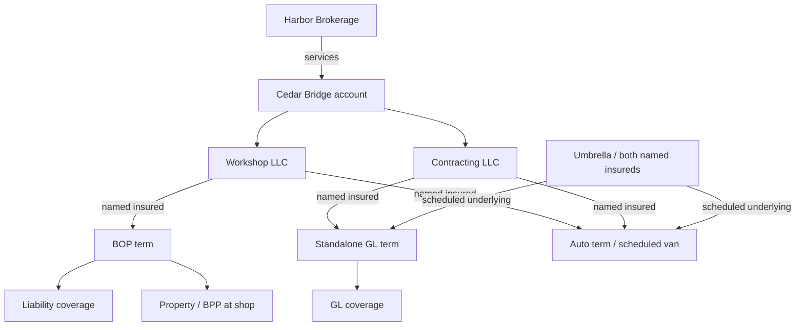

# Cedar Bridge — commercial P&C account walkthrough

**EX-PC-001 · Synthetic development example · Proposed representation · 2026-10-08**

This companion to the [small interchange example](../ontology-interchange/README.md) follows a contractor account from documents to scoped parties, policies, coverages, assertions, reviewed facts and a historical projection. The existing EX-GL-001/EX-INTEROP identities and releases keep their original meanings. This draft uses a separate `https://example.invalid/nebula/ont/commercial-example/` vocabulary namespace; production term alignment is a future F0012 decision.

All organizations, documents, policies, amounts, reviews and commits are invented. No extraction model, Nebula commit service, assessment engine, authorization service or AGE writer produced these records. The optional RDF tool installation failed on DNS in the authoring environment. RDF equivalence, reasoning, queries and SHACL results are **authored expectations awaiting execution**; the prior bundle's observed results do not cover these new files.

## 1. One account, distinct insureds and roles

The **Cedar Bridge** account groups two organizations: **Cedar Bridge Workshop LLC** and **Cedar Bridge Contracting LLC**. The workshop has a BOP; the contracting organization has standalone GL. Both appear on the auto and umbrella declarations. An account relationship alone never makes a party a named insured.

| Participant | What the example represents | Boundary |
|---|---|---|
| Account | Business relationship grouping the two organizations and four policies | A grouping record is not a legal insured or structural tenant |
| Workshop LLC | Named insured on the BOP, auto and umbrella terms | Not automatically a named insured on the contracting GL term |
| Contracting LLC | Named insured on the GL, auto and umbrella terms | Not automatically covered by Workshop's BOP |
| Harbor Example Brokerage | Account servicing role and separately scoped placement roles | A broker relationship grants no application access |
| Example Maple Mutual / Example Granite Casualty | Insurer roles on specific policy terms | Similar identifiers and shared producers do not merge insurers/policies |
| Example Delegated Underwriting MGA | Handles the contracting submission | Does not become the carrier; the fixture proves no delegation authority |
| Rowan Example | Person acting for the MGA on that submission | Underwriter role differs from an authenticated application principal |
| Shop, yard and van | Location/vehicle references attached to the relevant party or coverage | One account does not make all its property/vehicles insured under every policy |

Party roles are explicit `RoleAssignment` nodes with a party, role kind and scope. Their accepted relationships have the same temporal and evidence obligations as other statements. The common role pattern is a proposal for F0012/F0013 to settle, not a new production authorization model.



Arrows summarize the worked case. The actual snapshot retains intermediary role assignments, term identity and qualified monetary nodes; this diagram is not a flattened storage schema.

## 2. Two coverage lines in depth, with a wider program

Separate **product/package type** from **coverage line**. BOP is a package with property and liability sections; the liability section and standalone GL reuse common vocabulary while retaining their own forms, scope and terms. A common class never establishes equivalent policy wording. Carrier descriptions illustrate this distinction: [BOP liability/property/business-income components](https://www.travelers.com/business-insurance/general-liability), [commercial property in BOP](https://www.travelers.com/business-insurance/property).

| Product / line | What is represented | Example-specific limits or status |
|---|---|---|
| Standalone GL | Contractor, policy term, insurer, broker, occurrence trigger, two qualified limits | USD 1M each occurrence; USD 2M general aggregate |
| BOP liability | Workshop's separate coverage section | USD 1M each occurrence; USD 2M general aggregate; full form/trigger text not supplied |
| BOP property | Workshop BPP at the shop, limit, deductible and endorsement | USD 150k changing to USD 200k; USD 1k per-loss deductible |
| Commercial auto | Both insureds, scheduled van and liability CSL | USD 1M combined single limit per accident; physical-damage terms unknown |
| Umbrella | Both insureds, its own limit and exact underlying GL/auto terms | USD 2M each occurrence; attachment/exhaustion not determined |
| Workers compensation / employers liability | Broker's requested quotation | No issued-policy assertion or coverage amount in this package |
| Inland marine tools | Separate request for a tools/equipment quotation | No inference that workshop BPP covers mobile tools at job sites |

The synthetic source declares these selections; this is not a recommendation that a contractor qualifies for a carrier's BOP or has an adequate insurance program. No universal BOP coverage, limit ratio, form edition, state rule or umbrella response is encoded. An umbrella schedule is useful context but is insufficient to determine coverage for a claim. [Carrier overview of commercial umbrella](https://www.travelers.com/business-insurance/commercial-umbrella).

## 3. Follow the documents into the graph

1. Read the eight excerpts in [source-package.md](source-package.md): account/placement, BOP, GL, auto, umbrella, broker request, endorsement and loss notice.
2. Inspect [records.json](records.json): **61 identity/classification rows, 128 assertions, 125 slots, 127 fact versions**, plus source evidence, illustrative interpretation runs, reviews and commits. Its [JSON Schema](../../schemas/commercial-pc-example.schema.json) describes teaching records only.
3. Follow a fact's `assertion_ref` to `run_ref` and `evidence_ref`; follow `commit_ref` to the review that accepted that reading. A source-reading acceptance is not a policy issuance, coverage determination or regulatory approval.
4. Read [snapshot.ttl](snapshot.ttl) or [snapshot.jsonld](snapshot.jsonld). Both are intended to represent the same **125 accepted business statements**, plus authored type/label metadata, at `valid_as_of = 2026-07-05` and `known_as_of = 2026-07-11`.
5. Use [snapshot-index.json](snapshot-index.json) to recover each projected business statement's exact fact, assertion, evidence and commit IDs. Identity/type/label rows cite their sources in `records.entities`; they are explicitly authored classification metadata rather than extra committed business facts.

All rows inherit the bundle's single synthetic tenant/KB context. That envelope does not authorize a request. The projection is a scoped view, not a replacement for the PostgreSQL kernel or a serialization of its full production schema. Relationship slots distinguish target identities; money slots retain currency and basis qualifiers. Production identity/cardinality rules still belong to their owning feature plans.

The `runs` are authored illustrations, not model executions. An `OPEN` route identifies how that document section might produce source statements; its release reference records interpretation context and does not put ontology into an OPEN prompt. Requests remain in the assertion layer here. Accepting a fact about a request in a future contract must still preserve its mood; it cannot manufacture an issued coverage.

## 4. An endorsement changes one fact, at two times

The property endorsement takes effect July 1 and is accepted July 10. The old full-year BPP fact's recorded interval closes on July 10. Two newly recorded versions represent the retained January–June interval and revised July–December interval. All intervals are half-open `[start, end)`; UTC is an explicit teaching simplification.

| Valid as of | Known as of | BPP amount | Exact fact version |
|---|---|---|---|
| July 5 | July 8 | USD 150,000 | `EX-PC-F-BPP-ORIGINAL` |
| July 5 | July 11 | USD 200,000 | `EX-PC-F-BPP-REVISED` |
| June 30 | July 11 | USD 150,000 | `EX-PC-F-BPP-RETAINED` |

The BOP liability and standalone GL limits do not change. Property-summary completeness is a separate consumer contract; F0065's GL rule must not be applied to a BPP amount just because both are money. Historical reads continue to require current authorization.

## 5. Files, modules and release composition

| File | Purpose |
|---|---|
| [ontology.yaml](ontology.yaml) | Proposed class/property ownership, temporal annotations, rule subset and per-consumer constraint execution |
| [foundation.ttl](foundation.ttl) | Parties, account, roles, places and vehicle identity |
| [insurance-core.ttl](insurance-core.ttl) | Policies, terms, product types, coverages and qualified money |
| [general-liability.ttl](general-liability.ttl) | GL coverage specialization |
| [property.ttl](property.ttl) | Property coverage and location scope |
| [program-extensions.ttl](program-extensions.ttl) | Lightweight auto and umbrella concepts |
| [release.yaml](release.yaml) | Exact illustrative module versions, dependency locks and artifact digests |
| [projection-mapping.yaml](projection-mapping.yaml) | Proposed graph mappings, explicit omissions and lineage obligations |
| [shapes.ttl](shapes.ttl) | Supplied-value and scoped-role-record checks |
| [gl-completeness.ttl](gl-completeness.ttl) | GL each-occurrence input completeness; an aggregate does not substitute |
| [property-completeness.ttl](property-completeness.ttl) | BPP amount and location completeness for a property summary |
| [expected-inferences.ttl](expected-inferences.ttl) | Five selected type/inverse consequences |
| [cases.md](cases.md), [expected-results.yaml](expected-results.yaml) | Worked/boundary cases and authored outcomes |
| [queries/](queries/) | Account program, coverage money, and umbrella schedule traversals |
| [boundaries/](boundaries/) | Independent missing-input and malformed-value graphs |

The five module version IRIs differ from the composed release IRI. Dependencies are resolved locally through the manifest; there are no remote `owl:imports`. The YAML and OWL files are manually maintained counterparts, not outputs of a production ontology compiler. Their teaching schema does not freeze F0012's authoring schema. The release's file digests identify bytes, not semantic equivalence or compatibility. Domain/range declarations also infer types; they are not supplied-value requirements. No OWL axiom creates an unobserved coverage from a product label.

Run the three queries individually against the **asserted snapshot**, without adding the inferred closure: [account program](queries/account-program.rq) expects six policy/insured rows, [money](queries/coverage-money.rq) eight qualified values, and [underlying schedule](queries/umbrella-schedule.rq) the GL and auto terms. An account-wide sum of those amounts would mix coverage, basis and layer semantics.

## 6. Reproduction and evidence boundary

From the product root, `python3 scripts/validation/validate_semantic_examples.py` checks the teaching schema, IDs, evidence quotes/references, review/commit lineage, time intervals, the selected snapshot index, and the three authored timeline expectations. This is a structural fixture check, not execution of Nebula's historical-query engine.

For RDF checks, use an isolated environment with `rdflib==7.1.4 pyshacl==0.30.1 owlrl==7.1.4 PyYAML==6.0.3`. No new RDF dependency is required by the product runtime. With those packages installed, run from this directory:

```python
from pathlib import Path
import yaml
from rdflib import Graph
from rdflib.compare import isomorphic
from owlrl import DeductiveClosure, OWLRL_Semantics
from pyshacl import validate

manifest = yaml.safe_load(Path('release.yaml').read_text())
expected = yaml.safe_load(Path('expected-results.yaml').read_text())
asserted = Graph().parse('snapshot.ttl', format='turtle')
assert isomorphic(asserted, Graph().parse('snapshot.jsonld', format='json-ld'))
closure = Graph() + asserted
for module in manifest['modules']:
    closure.parse(module['file'], format='turtle')
consequences = Graph().parse('expected-inferences.ttl', format='turtle')
assert all(t not in asserted for t in consequences)
DeductiveClosure(OWLRL_Semantics).expand(closure)
assert all(t in closure for t in consequences)
for case in expected['shacl']:
    conforms, _, report = validate(
        Graph().parse(case['data'], format='turtle'),
        shacl_graph=Graph().parse(case['shape'], format='turtle'),
        inference='none', meta_shacl=True, do_owl_imports=False)
    assert conforms == case['conforms'], report
for query in expected['queries']:
    assert len(list(asserted.query(Path(query['file']).read_text()))) == query['rows']
print('Selected RDF, inference, SHACL and query expectations matched')
```

A successful run would establish only these selected checks. SHACL does not emit `UNKNOWN`, decide claim coverage, establish authority or sum an insurance program. Record Python/package versions, actual outputs and fixture hashes when execution becomes available. Current authored expectations are not observed results.

## 7. Ownership and maintaining the planning KG

| Contract | Planning owner / boundary |
|---|---|
| Shared identity, account/party roles, module/release schema | F0012; production mapping still to be settled |
| Insurance core and GL vocabulary | F0013, with explicit product/coverage distinction |
| Profile packaging and route separation | F0014/F0015; OPEN prompts stay ontology-free |
| Scoped identifiers and temporal facts | F0017/F0008/F0010; link their existing contracts |
| Authorized admission and evidence | F0018/F0022 and accepted F0002 boundaries |
| GL assessments | F0065; property/auto/umbrella do not inherit its operation |
| AGE projection | F0034, v0.2A; these mappings are proposed |
| BOP property, auto, umbrella, WC and inland-marine runtime delivery | Illustrative future breadth; no feature commitment or delivery date assigned by this example |

The planning KG indexes **shared concepts, this example schema, feature owners and source documents**. The invented Cedar Bridge parties, policies and claims stay in this folder; they are not canonical planning nodes or runtime facts. [The handoff](../../architecture/commercial-pc-example-handoff.md) specifies source precedence, compilation, coverage refresh and actual lookup checks. No feature status, ADR acceptance or roadmap phase is advanced by this example.
