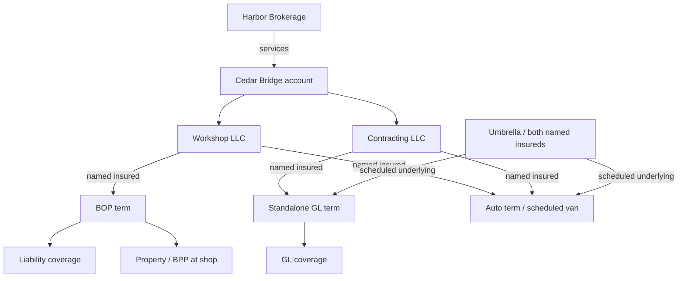

# Cedar Bridge — commercial P&C account walkthrough

**EX-PC-001 · Synthetic development example · Proposed representation · 2026-10-08, time model revised 2026-10-09**

> **Status.** Everything here is invented and hand-authored: organizations, documents, policies, amounts, interpretation runs, reviews and commits. No extraction model, commit service, assessment engine, authorization service or AGE writer produced it. The representation is a proposal for F0012/F0013 to accept, change or reject; it changes no feature status, ADR or roadmap phase. The RDF, OWL-RL, SHACL and query expectations are executed by the `semantic_rdf` gate, and [expected-results.yaml](expected-results.yaml) records that execution.

This companion to the [small interchange example](../ontology-interchange/README.md) follows a contractor account from documents to scoped parties, policies, coverages, assertions, reviewed facts and a historical projection. It uses its own vocabulary namespace, `https://example.invalid/nebula/ont/commercial-example/`, so EX-GL-001 and EX-INTEROP keep their meanings. Aligning terms with the production namespace is an F0012 decision.

## 1. One account, distinct insureds and roles

The **Cedar Bridge** account groups two organizations: **Cedar Bridge Workshop LLC** and **Cedar Bridge Contracting LLC**. The workshop has a BOP and the contracting organization a standalone GL policy. Both are named on the auto and umbrella declarations. Named-insured status comes from each policy term's role assignments, never from account membership.

Treating an account as a grouping is one side of an [open decision](../../BLUEPRINT.md#48-open-decisions): the glossary defines Account as the insured business itself, and the answer also decides what an account-scoped grant reaches.

| Participant | Represented as | Boundary |
|---|---|---|
| Account | Grouping of the two organizations and four policies | Separate from a named insured and from a structural tenant |
| Workshop LLC | Named insured on the BOP, auto and umbrella terms | Named on the GL term only if the GL declarations say so; they don't |
| Contracting LLC | Named insured on the GL, auto and umbrella terms | Covered by the BOP only if named on it; it isn't |
| Harbor Example Brokerage | Account servicing role and per-term placement roles | A broker role grants no application access |
| Example Maple Mutual / Example Granite Casualty | Carrier roles on specific policy terms | Each policy keeps its own carrier, even with shared numbers or producers |
| Example Delegated Underwriting MGA | Handles the contracting submission | Granite is the GL carrier; the fixture shows no delegated authority |
| Rowan Example | Underwriter acting for the MGA on that submission | A domain role, distinct from an authenticated application principal |
| Shop, yard and van | Location and vehicle references | Insured only where a coverage names them |

Party roles are `RoleAssignment` nodes with a party, a role kind and a scope. The role pattern is a proposal for F0012/F0013 and is unrelated to the authorization model.



The diagram summarizes; the snapshot keeps the role-assignment, term and monetary nodes it flattens.

## 2. Two coverage lines in depth, with a wider program

**Product/package type** and **coverage line** are separate concepts. A BOP packages property and liability sections. The BOP's liability section and the standalone GL policy share vocabulary while keeping their own forms, scope and terms; a shared class says nothing about equivalent wording.

| Product / line | Represented | Values in the source |
|---|---|---|
| Standalone GL | Contractor, term, carrier, broker, occurrence trigger, two qualified limits | USD 1M each occurrence; USD 2M general aggregate |
| BOP liability | Workshop's liability section | USD 1M each occurrence; USD 2M general aggregate; form and trigger text not supplied |
| BOP property | Workshop BPP at the shop, limit, deductible, endorsement | USD 150k, then USD 200k from July 1; USD 1k per-loss deductible |
| Commercial auto | Both insureds, scheduled van, liability CSL | USD 1M combined single limit per accident; physical-damage terms not supplied |
| Umbrella | Both insureds, own limit, scheduled GL and auto terms | USD 2M each occurrence; attachment and exhaustion undetermined |
| Workers compensation / employers liability | Broker's quotation request | Requested only |
| Inland marine tools | Separate quotation request | Requested only; workshop BPP says nothing about tools at job sites |

The example encodes this account's declarations only: no eligibility rules, limit ratios, form editions, state rules or umbrella responses. Determining coverage for a claim needs the forms, the facts of the claim and evidence of attachment; the schedule is context.

## 3. Follow the documents into the graph

1. Read the eight excerpts in [source-package.md](source-package.md): account record, BOP, GL, auto, umbrella, broker request, endorsement and loss notice. Each states its document date.
2. Inspect [records.json](records.json): **61 identity rows, 9 evidence excerpts, 129 assertions, 125 slots, 128 fact versions**, with interpretation runs, reviews and commits. Its [JSON Schema](../../schemas/commercial-pc-example.schema.json) describes these teaching records.
3. Follow a fact's `assertion_ref` to `run_ref` and `evidence_ref`, and its `commit_ref` to the review that accepted the reading. Accepting a reading records what the source says; it issues no policy and decides no coverage.
4. Read [snapshot.ttl](snapshot.ttl) or [snapshot.jsonld](snapshot.jsonld): **124 business statements** plus type and label metadata, at `valid_as_of = 2026-07-05` and `known_as_of = 2026-07-11`. Both are generated from `records.json`.
5. Use [snapshot-index.json](snapshot-index.json) to recover each statement's fact, assertion, evidence and commit. Type and label rows cite their evidence in `records.entities`.

All rows sit in one synthetic tenant/KB context, which authorizes nothing. The snapshot is a scoped view of accepted facts, not the PostgreSQL kernel's schema. Relationship slots distinguish target identities; money slots keep currency and basis qualifiers.

The `runs` illustrate interpretation routes. An `OPEN` run's release reference records interpretation context; the ontology stays out of OPEN prompts. The two coverage requests stay as `REQUEST`-mood assertions and never become facts about issued coverage.

## 4. Time: kinds, precision and unknown bounds

Each property declares a `temporal_kind` in [ontology.yaml](ontology.yaml), following proposed ADR-0064:

| Kind | Properties | Valid time |
|---|---|---|
| `ETERNAL` | policy number, product type, term period, coverage-of, monetary basis and currency, role kind and scope | none; identity and structure |
| `STATE` | limits, deductibles, schedules, location, role party, account membership, operating location | an interval with per-bound granularity, `attested_from`, and an `OPEN`, `BOUNDED` or `UNKNOWN` end |
| `EVENT` | the loss notice, coverage requests | a point at its stated granularity |

Policy-term facts are `BOUNDED` by the declared period at `DAY` granularity. Relationships the sources never date (account membership, operating locations, servicing and MGA roles) have an unknown start: `from` is null and `attested_from` is the document date. Before that date they read `UNKNOWN`, never "since always".

**The endorsement** shows three times: valid from July 1, attested July 8 (its document date), recorded July 10. Its commit closes the full-year BPP version in recorded time and adds a retained January–June version and a revised July–December version. Intervals are half-open; UTC is a teaching simplification.

| Valid as of | Known as of | BPP reading | Fact version |
|---|---|---|---|
| July 5 | July 8 | USD 150,000 | `EX-PC-F-BPP-ORIGINAL` |
| July 5 | July 11 | USD 200,000 | `EX-PC-F-BPP-REVISED` |
| June 30 | July 11 | USD 150,000 | `EX-PC-F-BPP-RETAINED` |
| Dec 31, 2025 | July 11 | absent (before the term) | — |

**The yard** shows an unknown end. The broker's May 15 request says Contracting no longer operates there, without a date. That reading closes the open version and adds one whose end is `UNKNOWN` with `attested_to: 2026-05-15`, so March reads `UNKNOWN` and July reads absent ([EX-PC-014](cases.md#ex-pc-014--unknown-start-and-unknown-end)). The yard relationship is therefore missing from the July snapshot.

A snapshot includes `ETERNAL` facts, `STATE` facts that read as a value, and `EVENT` facts that occurred by `valid_as_of`. [expected-results.yaml](expected-results.yaml) lists ten timeline readings with their exact fact versions. Liability limits do not change; property-summary completeness is a separate consumer from F0065's GL rule. Historical reads still require current authorization.

## 5. Files, modules and release composition

| File | Purpose |
|---|---|
| [ontology.yaml](ontology.yaml) | Proposed class/property ownership, temporal kinds, rule subset and per-consumer constraint execution |
| [foundation.ttl](foundation.ttl) | Parties, account, roles, places and vehicle identity |
| [insurance-core.ttl](insurance-core.ttl) | Policies, terms, product types, coverages and qualified money |
| [general-liability.ttl](general-liability.ttl) | GL coverage specialization |
| [property.ttl](property.ttl) | Property coverage and location scope |
| [program-extensions.ttl](program-extensions.ttl) | Lightweight auto and umbrella concepts |
| [release.yaml](release.yaml) | Illustrative module versions, dependency locks and artifact digests |
| [projection-mapping.yaml](projection-mapping.yaml) | Proposed graph mappings, explicit omissions and lineage obligations |
| [shapes.ttl](shapes.ttl) | Supplied-value and scoped-role-record checks |
| [gl-completeness.ttl](gl-completeness.ttl) | GL each-occurrence input completeness; an aggregate does not substitute |
| [property-completeness.ttl](property-completeness.ttl) | BPP amount and location completeness for a property summary |
| [expected-inferences.ttl](expected-inferences.ttl) | Five selected type/inverse consequences |
| [cases.md](cases.md), [expected-results.yaml](expected-results.yaml) | Worked and boundary cases with authored outcomes |
| [queries/](queries/) | Account program, coverage money, umbrella schedule and schedule review |
| [boundaries/](boundaries/) | Independent missing-input and malformed-value graphs |

Module version IRIs differ from the composed release IRI, and dependencies resolve through the manifest rather than remote `owl:imports`. The YAML and OWL files are hand-maintained counterparts. Release digests identify bytes; compatibility is a separate judgment. Domain and range declarations infer types only; no axiom creates a coverage from a product label.

Run the queries against the **asserted snapshot**, without the inferred closure:

- [account program](queries/account-program.rq): six policy/insured rows;
- [coverage money](queries/coverage-money.rq): eight qualified values, which must never be summed across coverage, basis or layer;
- [umbrella schedule](queries/umbrella-schedule.rq): the GL and auto terms;
- [schedule review](queries/umbrella-schedule-review.rq): one row, Workshop's unscheduled BOP liability, a prompt for an underwriter's question ([EX-PC-013](cases.md#ex-pc-013--an-unscheduled-primary-is-a-review-prompt)).

## 6. Reproduction

From the product root, `python3 scripts/validation/validate_semantic_examples.py` checks the schema, IDs, evidence quotes and document dates, review/commit lineage, temporal kinds and attestations, version overlap, the timeline readings, and that the three snapshot files match the generator. It is a fixture check, not Nebula's historical-query engine.

The snapshot files are generated: edit `records.json`, never the snapshots.

```bash
python3 scripts/validation/build_commercial_pc_snapshot.py --refresh-digests  # regenerate snapshots, refresh release.yaml digests
pip install -e '.[semantic-rdf]'                                           # optional planning tools; no runtime dependency
python3 scripts/validation/validate_semantic_rdf.py --require              # isomorphism, OWL-RL, SHACL, queries
```

Without the optional tools, `validate_semantic_rdf.py` reports `skipped`; CI runs it with `--require`. Generated snapshots write strings as simple literals because rdflib and pySHACL compare terms: `sh:hasValue "EachOccurrence"` does not match `"EachOccurrence"^^xsd:string`.

A pass establishes the selected checks only. SHACL emits no `UNKNOWN`, decides no claim, establishes no authority and sums no program.

## 7. Ownership and the planning KG

| Contract | Planning owner |
|---|---|
| Shared identity, account/party roles, module/release schema | F0012; account model is an open decision |
| Insurance core and GL vocabulary | F0013, with the product/coverage distinction |
| Profile packaging and route separation | F0014/F0015; OPEN prompts stay ontology-free |
| Scoped identifiers | F0017 |
| Valid-time kinds, precision, unknown bounds, temporal storage | F0008/F0010, F0016 time mentions, ADR-0064 |
| Authorized admission and evidence | F0018/F0022 within F0002's accepted boundaries |
| GL assessments | F0065 only; property, auto and umbrella are outside it |
| AGE projection | F0034, v0.2A |
| BOP property, auto, umbrella, WC and inland-marine runtime delivery | Unassigned; illustrative breadth |

The planning KG indexes shared concepts, this example's schema, feature owners and source documents; the Cedar Bridge parties and policies stay in this folder. [The handoff](../../architecture/commercial-pc-example-handoff.md) covers source precedence, compilation and lookup checks.
