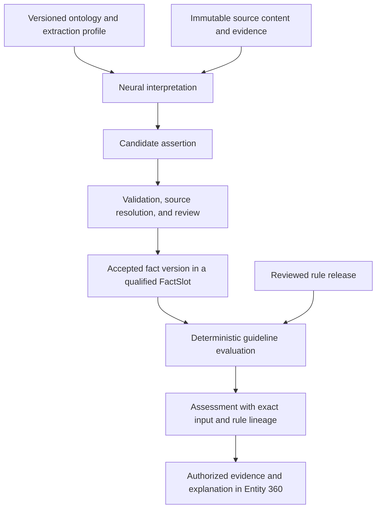

# EX-GL-001 — From policy evidence to a guideline assessment

**Delivery:** F0065/F0024/F0025, v0.1B; F0026 release evaluation, v0.1C.
**Status:** Synthetic planning example. Every model output, review, fact, and assessment shown here is illustrative; no runtime execution or measured confidence is claimed.

## Business question

Does the applicable each-occurrence limit for this policy meet the specified guideline? The [synthetic source package](source-package.md) supplies a $500,000 policy limit, a fictional $1,000,000 minimum, and a later $2,000,000 endorsement. A contributor should be able to explain both the comparison and why the Brain believes its inputs.

The ontology/profile constrains what the model should extract. The model proposes an interpretation. Canonical acceptance and the rule evaluation have explicit semantics. This interaction is the neurosymbolic workflow; adding a vector field to an entity is not required to perform it.

## Representation notes

`insurance.coverage` in [records.json](records.json) is a concept definition. `EX-COV-001` is one coverage entity. `EX-SLOT-001` asks one semantic question about it: the USD each-occurrence limit. The $2,000,000 aggregate limit belongs to a different slot even though it appears on the same declarations page.

An edge such as `requiresProof → PolicyDocument` describes a requirement for a document type; an evidence binding points to a particular source region. The binding alone does not prove that all applicable requirements are satisfied. `ValidPolicy(x) → Approved(x)` would need separately defined predicates, business authority, and executable rule semantics. F0065 supports one reviewed monetary comparison, not arbitrary logic strings or approval inference.

The structured bundle is an educational read view, validated by [its schema](../../schemas/semantic-example.schema.json). Its short IDs, excerpt locators, and simplified records are not production API payloads. Runtime binding must use the existing [InterpretationResult](../../schemas/interpretation-result.schema.json) and canonical contracts and the proposed [assessment contract](../../features/F0065-grounded-gl-guideline-assessment/assessment-contract.md). No embedding, rule, or merged JSON object becomes a second authority over canonical facts.

## Source to fact

1. **Source/evidence:** `EX-EV-001` identifies the each-occurrence wording in the policy declarations; `EX-EV-002` identifies the endorsement. The artifact/run IDs in the bundle are illustrative identities. Runtime evidence must resolve to the immutable artifact at its declared precision (F0004/F0005/F0009).
2. **Interpretation:** `EX-RUN-001` applies the GL extraction profile. `EX-A-001` claims an each-occurrence amount of `500000.00`, currency USD, with `EXPLICIT` interpretation basis and illustrative model confidence `0.94` (F0015/F0016).
3. **Review/acceptance:** `EX-REVIEW-001` checks source wording. `EX-COMMIT-001` separately records governed canonical acceptance. Annotation and business authority are distinct; model confidence does not authorize a commit (F0018/F0022).
4. **Canonical fact:** `EX-F-001` records the accepted value in `EX-SLOT-001`, qualified by coverage, basis, currency, and time. The originating assertion and evidence remain reachable. A canonical fact has no copied “94% approval confidence.”

CASE-05 illustrates a deliberately wrong model extraction of $5,000,000 at confidence 0.99. The reviewer corrects the value against the source; both assertion versions and correction lineage survive. CASE-06 leaves a high-confidence assertion unaccepted: it cannot supply an assessment input. These are independent challenge variations, not additional accepted facts in the main timeline.

## Assessment

`EX-RULE-001-v1` specifies `money_gte_minimum` against `1000000.00` USD for the named coverage and each-occurrence basis. Rule source and authority point to the fictional guideline; this authority is not inferred from document similarity.

`EX-ASSESS-001` uses `EX-F-001` and that rule version at its stored snapshot: `500000.00 >= 1000000.00` is false, so the outcome is `BELOW_GUIDELINE`. The record preserves its input fact, rule, ontology/evaluator versions, time basis, acting principal, and audit reference. The source quotation supports the limit; the rule and comparison support the assessment. The assessment does not claim the source document itself says “below guideline.”

The UI should say: “Below the Example GL minimum: USD 500,000 each occurrence compared with USD 1,000,000. Assessed for February 1 using knowledge accepted by February 2.” It links to the rule and source. It does not say “Policy rejected” or present an ungrounded risk score.

## Temporal walkthrough

The endorsement is effective July 1, received July 9, and accepted July 10 at noon. The following exact coordinates are UTC; production dates retain their declared source timezone under the kernel contract.

| Valid as of | Known as of | Fact version | Limit | Expected outcome |
|---|---|---|---|---|
| February 1 | February 2 | EX-F-001 | $500,000 | BELOW_GUIDELINE |
| July 5 | July 8 | EX-F-001 | $500,000 | BELOW_GUIDELINE |
| July 5 | July 11 | EX-F-003 | $2,000,000 | MEETS_GUIDELINE |
| June 30 | July 11 | EX-F-002 | $500,000 | BELOW_GUIDELINE |

`EX-F-001` represents the original knowledge before July 10 acceptance. The updated snapshot uses `EX-F-002` for the unaffected pre-July interval and `EX-F-003` from July 1 onward. These are distinct fact versions, not contradictory current values. Earlier saved assessments remain historical. Current requests resolve a new snapshot and recompute; F0065 does not need an automatic derivation-propagation engine.

## Boundary cases and review

Read [cases.md](cases.md) for the independently authored expected cases and their story owners. Inaccessible evidence is an authorization failure, not `UNKNOWN`. Missingness describes authorized knowledge gaps only. Even historical assessment reads use current grants.

Use the [concept coverage map](../README.md) to connect each example to the glossary and feature. The [future examples](../future-semantics.md) show embeddings, obligations, learning, and scenarios with their delivery phases explicitly marked.

## Reproduction status

Available now: `python3 scripts/validation/validate_semantic_examples.py` checks this bundle's schema and references. It does not run a model, compare monetary values, perform temporal querying, or prove authorization behavior.

Required when implemented: F0065 S0006 documents an actual command that builds the native/scanned synthetic inputs, runs the F0024 interpretation/review/commit path, evaluates the comparisons and F0025 timeline, and compares observed outputs against these cases. Store the observed evidence in the normal runtime evidence package and link it here. The documentation fixture remains development data, separate from the frozen holdout.
