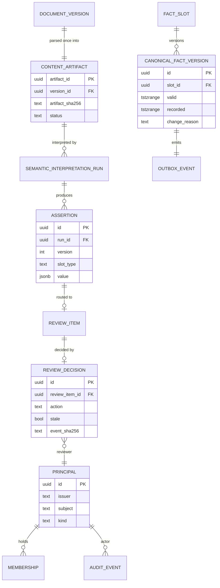

# F0001 — Repository and engineering foundation

**Status:** Draft — plan approved 2026-09-06; ready for the feature action
**Priority:** Critical
**Phase:** Infrastructure

## Overview

Stand up the `engine/` and `neuron/` runtime roots with their toolchain and CI, the local dependency stack (PostgreSQL with pgvector and Apache AGE, object storage, authentik), and execute the four pre-build contract proofs from master blueprint section 115.4 so their measured results settle the Proposed ADRs before v0.1A begins.

Source: `planning-mds/architecture/master-blueprint.md` sections 106.2, 108, 109, 111.1, 114, 115.4, 117.1. Governing ADRs: [ADR-0001](../../architecture/decisions/ADR-0001-the-brain-owns-semantics.md).

## Documents

| Document | Purpose |
|----------|---------|
| [PRD.md](./PRD.md) | Full product requirements (why + what + how) |
| [STATUS.md](./STATUS.md) | Completion checklist and progress tracking |
| [GETTING-STARTED.md](./GETTING-STARTED.md) | Developer/agent setup guide |
| [acceptance-criteria-checklist.md](./acceptance-criteria-checklist.md) | Acceptance-criteria quality checklist applied to this feature |

## Stories

| ID | Title | Status |
|----|-------|--------|
| [F0001-S0001](./F0001-S0001-runtime-roots-and-toolchain-skeleton.md) | Runtime roots and toolchain skeleton | Not Started |
| [F0001-S0002](./F0001-S0002-local-runtime-containers-and-dependency-matrix.md) | Local runtime containers and dependency matrix | Not Started |
| [F0001-S0003](./F0001-S0003-proof-parse-once-reinterpret-evidence.md) | Proof: parse once, reinterpret twice, evidence resolves | Not Started |
| [F0001-S0004](./F0001-S0004-proof-native-review-round-trip.md) | Proof: native review round trip with lineage | Not Started |
| [F0001-S0005](./F0001-S0005-proof-bitemporal-commit.md) | Proof: bitemporal commit under retroactive and concurrent change | Not Started |
| [F0001-S0006](./F0001-S0006-proof-access-boundaries-extension-build-and-restore.md) | Proof: access boundaries, extension build, and restore | Not Started |
| [F0001-S0007](./F0001-S0007-record-proof-outcomes-and-settle-contracts.md) | Record proof outcomes and settle the pre-build contracts | Not Started |

**Total Stories:** 7
**Completed:** 0 / 7

## Architecture Review

**Phase B status:** Approved 2026-09-06 at G5 (plan run `2026-09-06-cdb5d8cb`)
**Execution Plan:** [`feature-assembly-plan.md`](./feature-assembly-plan.md)

### Key Findings

- The proofs need real contracts to be testable, so Phase B authored the first OpenAPI document, six JSON Schemas, and the Casbin model and policy for the proof scope rather than deferring them to the feature action.
- S0006 must precede S0004 and S0005: the reviewer binding and the commit actor both need verified principals. Build order in the plan reflects this.
- Phi-4-mini-instruct's 4,096-token context is the one open technical risk; it is enforced client-side and measured as a recorded result rather than assumed.
- No existing code; the knowledge graph gains ten capabilities, ten entities, three workflows, six endpoints, six schemas, three roles, and five policy rules, with code bindings deferred to feature G7.

### Architecture Artifacts

| Artifact | Status |
|----------|--------|
| Data model / ERD | Feature ERD below; `architecture/data-model.md` unchanged (baseline tables already cover the proof entities) |
| API contract (OpenAPI) | Created `planning-mds/api/brain-api.yaml` (health, protected reads, webhook, commit) |
| Workflow state machine | Three workflows declared in `kg-source/nodes/workflows/` |
| Casbin policy | Created `planning-mds/security/policies/{model.conf,policy.csv}` |
| JSON schemas | Created six under `planning-mds/schemas/` |
| C4 diagrams | `architecture/c4-context.md` and `c4-container.md` created; ASCII companion in ADR-0054 |
| ADRs | ADR-0054 and ADR-0055 created; settlement lines added to ADR-0040, 0041, 0044, 0049, 0050 |
| Assembly plan | [`feature-assembly-plan.md`](./feature-assembly-plan.md) |

### Feature ERD (proof scope)



```text
DocumentVersion ──1:1──▶ ContentArtifact ──1:N──▶ InterpretationRun ──1:N──▶ Assertion ──0:1──▶ ReviewItem ──0:1──▶ ReviewDecision ──▶ Principal
FactSlot ──1:N──▶ CanonicalFactVersion ──1:1──▶ OutboxEvent          Principal ──1:N──▶ Membership, AuditEvent
```
