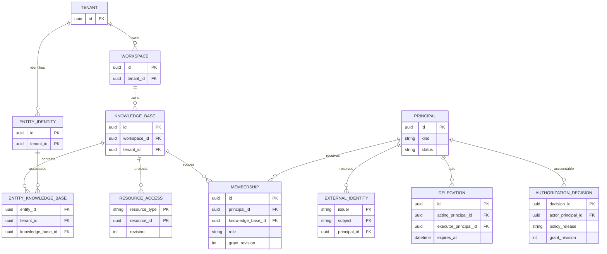
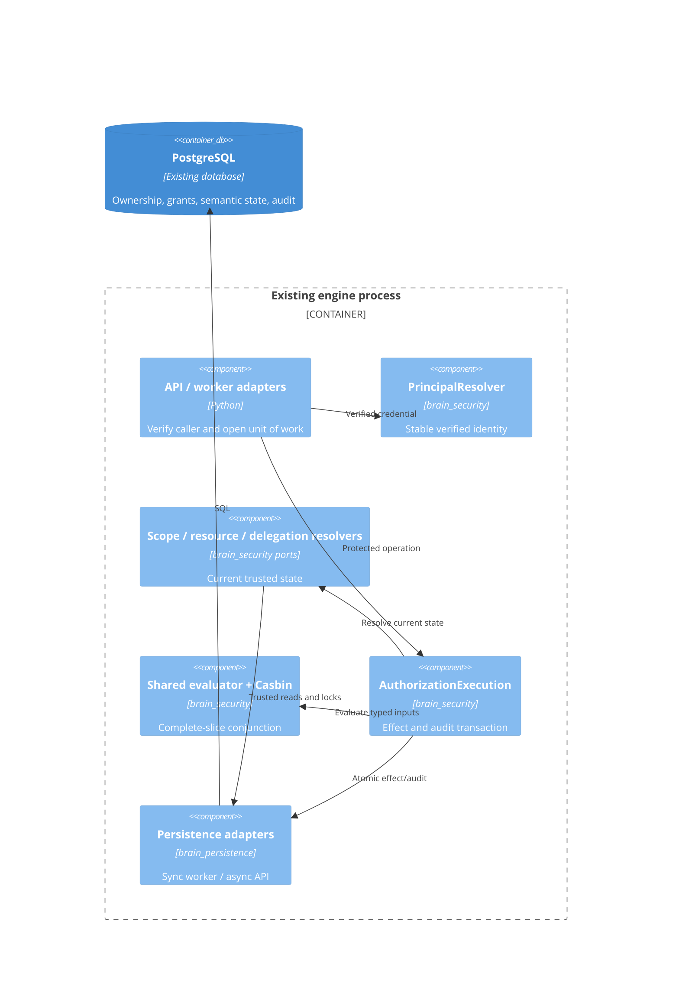

# F0002 — Tenancy-aware domain kernel + verified stable principal and scope contracts

**Status:** Planned — Phase A and Phase B approved on 2026-09-25; implementation not started
**Phase:** v0.1A · **Roadmap:** Next · **Total Stories:** 6

Build on F0001’s verified identity and scoped authorization. Preserve tenant-scoped entity identity, explicit KB grants and the existing pilot roles while adding structural ownership, current complete grant slices, resource restrictions, bounded delegation and durable audit.

## Documents

- [PRD](PRD.md), [personas](personas.md), [acceptance checklist](acceptance-criteria-checklist.md)
- [Assembly plan](feature-assembly-plan.md), [status](STATUS.md), [getting started](GETTING-STARTED.md)
- [Worked examples](worked-examples.md), [structured contract examples](contract-examples.json)
- [ADR-0061](../../architecture/decisions/ADR-0061-tenant-identity-and-structural-ownership.md), [ADR-0062](../../architecture/decisions/ADR-0062-current-authorization-and-durable-decisions.md)
- [OpenAPI](../../api/brain-api.yaml), [internal v1 schema](../../schemas/authx-kernel.schema.json)

## Stories

| ID | Title | Status |
|---|---|---|
| F0002-S0001 | [Preserve structural tenancy and tenant-scoped entity identity](F0002-S0001-structural-tenancy-and-entity-identity.md) | Not Started |
| F0002-S0002 | [Resolve verified credentials to stable typed principals](F0002-S0002-verified-stable-principal-resolution.md) | Not Started |
| F0002-S0003 | [Resolve current memberships and intersect requested scope](F0002-S0003-current-membership-and-request-scope.md) | Not Started |
| F0002-S0004 | [Enforce parent, classification and source restrictions together](F0002-S0004-conjunctive-resource-authorization.md) | Not Started |
| F0002-S0005 | [Bound delegated and autonomous service authority](F0002-S0005-bounded-delegation-and-service-authority.md) | Not Started |
| F0002-S0006 | [Prove audited kernel behavior through existing consumers](F0002-S0006-audit-and-consumer-contract-proof.md) | Not Started |

## Feature ERD — proposed ownership and security substrate



`AUTHORIZATION_DECISION` denotes the v1 audit payload on append-only audit events, not a second authoritative business store. Resource and membership ownership also carry tenant IDs, enforced by composite constraints in the assembly plan.

```text
Tenant -> Workspace -> KB -> semantic rows + ResourceAccess
  |                    |
  +-> EntityIdentity <-+ EntityKB association (not permission)
Principal <- ExternalIdentity
  +-> Membership -> KB + complete role/restriction slice
  +-> Delegation -> exact executor + ceiling + expiry
  +-> Decision audit (current actor/grants/policy/resource)
```

## Component view



No new service, container or browser surface. Existing [C4 context](../../architecture/c4-context.md) and [container](../../architecture/c4-container.md) remain applicable. Policy allow never overrides missing parent/classification/source/delegation requirements.
